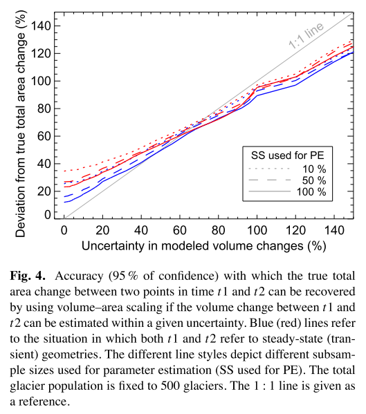

### An upper-bound estimate for the accuracy of glacier volume-area scaling

**Farinotti, Daniel and Huss, Matthias (2013)**

> Farinotti, D. and Huss, M.: An upper-bound estimate for the accuracy of glacier volume–area scaling, The Cryosphere, 7, 1707–1720, https://doi.org/10.5194/tc-7-1707-2013, 2013.

#### **Abstract**:

> [...] a series of resampling experiments based on different sets of synthetic data is presented in order to derive an upper bound estimate for [the] accuracy [of the volume-area scaling method]. For populations larger than a few thousand glaciers, the total ice volume can be recovered within 30% if all data currently available worldwide are used for estimating the scaling parameters. This paper does not aim at making a final judgement on the suitability of volume–area scaling as such, but provides the means for assessing the accuracy expected from its application. (Farinotti and Huss, 2013)

#### Conclusions:

> [...] the stated accuracies represent an upper-bound, i.e. a level of accuracy that will not be reached in applications with real data.

#### Introduction:

> Although Bahr et al. (1997) provided the physical basis for this relation, and its performance has already been addressed in the context of glacier volume projections (e.g., Radić et al., 2007, 2008; Bahr et al., 2009; Slangen and van de Wal, 2011), the appropriateness of volume–area scaling is currently highly debated. Recently, Adhikari and Marshall (2012) used higher-order mechanics for showing how estimated scaling parameters evolve over time if consider-ing transient glacier states, confirming the results by Radić et al. (2007), whereas Huss and Farinotti (2012) pointed out that parameters can also vary spatially on a continental scale. On the other hand, Bahr et al. (2012) emphasized the power of scaling relations in overcoming the intrinsically ill-posed problem of glacier volume estimations, whilst Grinsted (2013) showed how including additional parameters in the regression between area and volume is of benefit for in-creasing the predicting skills of scaling relations, as shown earlier by Lüthi (2009). (Farinotti and Huss, 2013)

The paragraph lists the latest studies which are using or addressing glacier volume-area scaling relations.

- [ ] Bahr et al. (1997)
- [ ] Radić et al. (2007)
- [ ] Radić et al. (2008)
- [ ] Bahr et al. (2009)
- [ ] Slangen and van de Wal (2011)
- [ ] Adhikari and Marshall (2012)
- [ ] Huss and Farinotti (2012)
- [ ] Bahr et al. (2012)
- [ ] Grinsted (2013)
- [ ] Lüthi (2009)

> [...] a series of synthetic experiments providing an upper-bound estimate (i.e. an estimate that is only reached in an ideal case, in which all assumptions are fulfilled) for the accuracy which can be expected when volume–area scaling is used for estimating (1) the total volume, (2) the total volume change, or (3) the total area change of a given glacier population. (Farinotti and Huss, 2013)

#### Using scaling for estimating total ice volume

> [...] investigate the accuracy with which the total volume of a glacier population can be recovered by using volume–area scaling if a limited subset of measured values of a given size and accuracy is available for estimating the parameters of the scaling relation (Eq. 1). (Farinotti and Huss, 2012)

**Generation of a synthetic data sample**

Using the real surface area of glaciers from the RGI, a set of over $1.7\cdot 10^5$ synthetic pairs of "true" glacier area and volume is constructed using the volume-area scaling relation with $c=0.033$ and $\gamma = 1.36$ varied by an i.i.d. with zero mean and standard deviation $\sigma_{V,\text{true}} = 0.3$. A corresponding set of "measured" pairs is generated by adding white noise to the "true" area and volume. Thereby assuming the glacier area is known within 5% at the 95% level of confidence ($\sigma_{A,\text{meas}} = 0.025$) while varying the volume in order to mimic different scenarios.
$$
\begin{equation}
\begin{split}
V_\text{true} = c\cdot A_\text{true}^\gamma \cdot \exp(\varepsilon_{V,\text{true}})
\end{split}
\qquad
\qquad
\begin{split}
V_\text{meas} = V_\text{true} \cdot \exp(\varepsilon_{V,\text{meas}})\\
A_\text{meas} = A_\text{true} \cdot \exp(\varepsilon_{A,\text{meas}})
\end{split}
\end{equation}
$$
**Experiment A**:

1. Select a sample $P$ of $n_P$ volume-area pairs from the global population $T$.
2. Out of $P$, select a subsample $Q$ of $n_Q$ volume-area pairs and consider the corresponding measured values. The volume estimate $\hat{V}_Q$ is the sum of all measured volumes and differs by an unknown amount from the true volume.
3. Estimate the scaling parameters $c$ and $\gamma$ using the subsample $Q$ (least-squared fit).
4. Estimate the volume $\hat{V}_R$ of all remaining glaciers in $P$ without measurements, using the volume-area scaling relation with the above computed parameters.
5. Compare the estimated volume $\hat{V}_Q + \hat{V}_R$ and the true volume $V_P$.
6. Determine an empirical confidence interval for the result, by repeating steps (1.) to (5.) 1000 times.

The whole experiment is performed for different population sizes $n_P$, $n_Q$ and different measurement accuracies $\sigma_{V,\text{meas}}$.

**Accuracy with which the total volume can be recovered** (Fig. 1a)

> [...] glacier population consists of $n_P$ = 10000 individual glaciers. For this case, the total volume can be recovered within ≈30% at the 95% level of confidence, if a subsample of at least 200 glaciers is available for estimating the parameters of the scaling relation.

The total glacier volume of a population estimated by the volume-area scaling relation deviates about 30% from the true volume, if the total population as well as the number of measured glaciers is large enough (e.g. 200 measurements out of 10'000 individual glaciers).

> [...] the effect of the uncertainty in the known glacier volumes becomes visible only if the subsample used for the estimation of the parameters is very small (<100 glaciers) or very large (≥4000 glaciers).

The accuracy of the volume measurements $\sigma_{V,\text{meas}}$ has an effect only for very small or very large subsamples used to determine the scaling parameters.

> The deterioration in accuracy with which the total volume is recovered if the size of the subsample used for estimating the parameters drops below ≈50 glaciers is very important.

The accuracy of the volume estimate drops drastically, if the size of the subsample used to determine the scaling parameters gets small enough.

> [...] the accuracy with which the true total volume can be recovered improves with increasing size of the considered glacier population $P$. For example, using 280 volume-area pairs for estimating the scaling parameters, and assuming an uncertainty in measured volumes of 20% [representing the current data availability] [...] increasing the number of glaciers to 171'000, i.e. the number of glaciers contained in the Randolph Glacier Inventory, leads to a maximal expected accuracy of ≈19 %.

The accuracy of the volume estimate increases with increased population size. For the given data availability (i.e., about 280 glacier ice volume measurements with about 20% accuracy and 171'000 glacier areas in the RGI) the total ice volume can be estimated within about 19% accuracy.

**Requirements for achieving a given accuracy** (Fig. 1b)

> [...] how many volume-area pairs are required for estimating the parameters of a scaling relation such that the total ice volume of a particular glacier population is recovered within a given accuracy.

By inverting the experiment, the minimal subsample size of glacier volume measurements to achieve a certain accuracy in total volume estimate can be determined. Thereby, the following two features are most prominent:

> (1) the relatively weak influence of the uncertainty in the known (“measured”) volumes for large sample sizes, and (2) the poor performance of the scaling approach for small sample sizes.

As before, the accuracy depends mostly on the subsample size used to compute the scaling parameters.

> [...] if a sufficient number of measured ice volumes are available, and scaling is applied to a sufficiently large sample of glaciers, the accuracy of the measurements itself is only of secondary importance.

The accuracy of the volume measurements $\sigma_{V,\text{meas}}$ is negligible if the population size is big enough, even though this does only account for normally distributed measurement errors and not systematic biases.

#### Using scaling for estimating changes in volume and area

Global estimates of sea level rise contributions from glaciers and ice caps rely heavily on volume-area scaling techniques. Thereby, the scaling is applied separately to two glacier inventories compiled at two different points in time, or the scaling relation is inverted to update the glacier area given a volume change computed by a mass balance model. Anyway, the time evolution of glacier area and volume needs to be know to perform the analysis. 

**Generation of a synthetic data sample**

Starting point are 1800 randomly selected glacier geometries from Huss and Farinotti (2012), which are then grown to a steady state by using a 3D full Stokes model (Jouvet et al., 2008). The model is initialized with the given glacier geometries and imposed with a constant climate prescribed by an altitude-dependent annual surface mass balance distribution (whereby the ELA is chose to yield an accumulation area ratio of 0.44). The next step consist of another 300 year of glacier evolution under an altered climate (uniform raise in ELA by 100 m) until a new equilibrium is reached. Only 743 of the initial glaciers reach a steady state under both climate forcings and therefore form the new global population $T$. Scaling parameters estimated are $\gamma = 1.34 \pm 0.02$ and $c = 0.030\pm0.001$ and $\gamma = 1.33 \pm 0.02$ and $c = 0.040\pm0.001$ for the first and second steady state population, respectively.

**Experiment B**

1. Select a sample $P$ of $n_P$ volume-area pairs from the global population $T$. The sample has two different states $P_1$ and $P_2$ representing the points in time $t_1$ and $t_2$ between which the total volume change shall be estimated.
2. Out of the combined population $P_1 \cup P_2$, select a subsample $Q$ of $n_Q$ volume-area pairs and consider the corresponding measured values. Thereby, subsample $Q$ will be composed of $n_{Q_1}$ volume-area pairs referring to time point $t_1$ and $n_{Q_2}$ volume-area pairs referring to time point $t_2$, with $n_Q = n_{Q_1} + n_{Q_2}$ and $n_{Q_1} \neq n_{Q_2}$.
3. Estimate the scaling parameters $c$ and $\gamma$ using the subsample $Q$ (least-squared fit), once, one individual set of parameters for both points in time (constant parameters) and once, two different sets for $t_1$ and $t_2$.
4. Estimate the volumes $\hat{V}_{R,1}$ and $\hat{V}_{R,2}$ of all remaining glaciers in $P$ without measurements for both points in time, using the volume-area scaling relation with the above computed parameters.
5. Compare the estimated total change in volume $\Delta\hat{V}_p = \hat{V}_{P,2} - \hat{V}_{P,1}$ and the true volume  change  $\Delta V_P$.
6. Determine an empirical confidence interval for the result, by repeating steps (1.) to (5.) 1000 times.

The whole experiment is performed for different population sizes $n_P$, $n_Q$ and different measurement accuracies $\sigma_{V,\text{meas}}$. Each of those experiments is performed two times, once where the two points in time refer to a steady state and once, where they do not (transient state).

**Accuracy of volume changes estimated from changes in area**

- [ ] Come back to it, if of use at some point...

**Experiment C**

If the volume change $\Delta V$ between two points in time is known from a mass balance model with a given uncertainty, the area of a glacier population can be updated by inverting the scaling relation. Updating the area is performed for each glacier individually by
$$
A_{t+\Delta t} = \left(\frac{\Delta V}{c} + A_t^\gamma\right)^\frac{1}{\gamma}
$$
A necessary assumption is that the scaling parameters are constant with time. For the following analysis the volume change $\Delta V$ is know from modeling only and the estimated value $\Delta\hat{V}$ is constructed by adding an individually independent distribution $\varepsilon_{\Delta V,\text{modeling}} \sim \mathcal{N}(0,\sigma_{\Delta V,\text{true}})$  centered around the true values with a given standard deviation.

1. Select a sample $P$ of $n_P$ volume-area pairs from the global population $T$, for which the area shall be updated between the points in time $t_1$ and $t_2$.
2. Out of $P$, select a subsample $Q$ of $n_Q$ volume-area pairs and consider the corresponding measured values referring to time $t_1$.
3. Estimate the scaling parameters $c$ and $\gamma$ using the subsample $Q$ (least-squared fit).
4. Assign random uncertainties to the modeled volume changes, using $\Delta\hat{V} = \Delta V_\text{true} + \varepsilon_{\Delta V,\text{modeling}}$
5. Calculate the updated glacier area $\hat A_{t+\Delta t}$ for the entire population $P$, the estimated area change $\Delta \hat A = \hat A_{t+\Delta t} - \hat A_{t}$ and compare it to the true area change obtained from the true values.
6. Determine an empirical confidence interval for the result, by repeating steps (1.) to (5.) 1000 times.

The whole experiment is performed for different population sizes $n_P$, $n_Q$ and different measurement accuracies $\sigma_{V,\text{meas}}$. Each of those experiments is performed two times, once where the two points in time refer to a steady state and once, where they do not (transient state).

**Accuracy of updated area estimated from volume changes** (Fig. 4)

> The accuracy with which the true total area change can be recovered is almost a linear function of the uncertainty with which the corresponding volume changes are known.

> The size of the subsample available for estimating the scaling parameters plays a marginal role

> [...] the true total area change can be recovered more precisely in the case of transitions between steady-state geometries than between transient states.

> As a rule of thumb, one can say that by inverting the scaling relation for updating the area of a glacier population, the true total area change can be recovered with an accuracy that is comparable to the uncertainty with which the corresponding volume changes are known if this uncertainty is high, and with a significantly lower accuracy if the uncertainty in the known volume changes is low.

**Estimating scaling parameters from measured volume changes**

Estimation of scaling parameters $c$ and $\gamma$ can be formulated as an optimization problem, if the parameters are held constant and measurements of glacier volume change and glacier area are available. However, the method seems neither robust nor efficient and its use in practical applications is therefore discouraged.

#### Applications with real-world data

A data set of 557 measurements of glacier volume and area changes, compiled from Cogley (2012), the WGMS (2012) and additional data for the Swiss Alps by different authors (Bauder, Huss, Farinotti, Gabbi).

- [ ] ...

