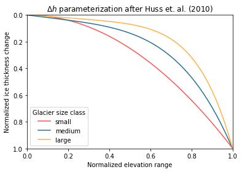

### A new model for global glacier change and sea-level rise

**Matthias Huss and Regine Hock (2015), Frontiers in Earth Science - https://doi.org/10.3389/feart.2015.00054**

#### Abstract

> The Global Glacier Evolution Model (GloGEM) includes mass loss due to frontal ablation at marine-terminating glacier fronts and accounts for glacier advance/retreat and surface elevation changes. Simulations are driven with monthly near-surface air temperature and precipitation... (Huss and Hock, 2015)

This is the GloGEM model explained as a one liner. One emphasis lies on the frontal ablation at marine-terminating glacier fronts (calving) and another on the effect of glacier ice grounded below sea level. Both not concerning me and my study area, since there are no oceans in the Alps. Also, the actual results of seal level rise are of a minor interest to me here...

#### Conclusions

> Instead of volume-area-length scaling we use an approach that allows glaciers to retreat and advance while also adjusting the surface elevation across the entire glacier. (Huss and Hock, 2015)

This is the part concerning my work the most, they are using a more complex model than I am.

> ... although melt clearly dominates ablation in all regions. (Huss and Hock, 2015)

Which is the case I'm trying to make

> Calculating snow and ice melt with a simplified energy-balance model instead of a degree-day model yields 16–22% lower estimates of glacier mass loss indicating a smaller sensitivity to temperature change. Despite a more physical approach, model performance slightly decreased in comparison to a classical degree-day model. (Huss and Hock, 2015)

This is interesting and I'll have to look into the differences between the mass balance models used here and in the OGGM.

>  Our sensitivity experiments indicate that the initial ice volume and the model calibration are major sources of uncertainty. (Huss and Hock, 2015)

You don't say... #captainobvious

#### Introduction

> During the last 10 years only six global-scale models have been reported in the literature (see [Radić and Hock, 2014](https://www.frontiersin.org/articles/10.3389/feart.2015.00054/full#B59), for a review). (Huss and Hock, 2015)

Have to see which those six models are...

> These highly simplified models either directly calculate the transient surface mass balance using the degree-day method ([Radić and Hock, 2011](https://www.frontiersin.org/articles/10.3389/feart.2015.00054/full#B58); [Marzeion et al., 2012](https://www.frontiersin.org/articles/10.3389/feart.2015.00054/full#B41); [Hirabayashi et al., 2013](https://www.frontiersin.org/articles/10.3389/feart.2015.00054/full#B24); [Bliss et al., 2014](https://www.frontiersin.org/articles/10.3389/feart.2015.00054/full#B7); [Radić et al., 2014](https://www.frontiersin.org/articles/10.3389/feart.2015.00054/full#B56)), adopt a sensitivity approach ([Slangen et al., 2012](https://www.frontiersin.org/articles/10.3389/feart.2015.00054/full#B62)) or perturb equilibrium line altitudes (ELAs) according to temperature anomalies ([Raper and Braithwaite, 2006](https://www.frontiersin.org/articles/10.3389/feart.2015.00054/full#B60)). (Huss and Hock, 2015)

This answers the above stated question somehow.

> ...[those simple models] suffer from a number of shortcomings. ...[relying] on scaling relations (often volume-area or volume-length scaling) to account for the dynamic response to modeled mass change, hence strongly simplifying the geometric adjustments caused by glacier dynamics. These approaches account for variations in glacier length but in a highly simplistic fashion, and also neglect changes in surface elevation. However, accurately modeling the glacier's geometric adjustment is crucial for capturing elevation-mass-balance feedbacks (e.g., [Oerlemans et al., 1998](https://www.frontiersin.org/articles/10.3389/feart.2015.00054/full#B49); [Huss et al., 2012](https://www.frontiersin.org/articles/10.3389/feart.2015.00054/full#B29); [Trüssel et al., 2015](https://www.frontiersin.org/articles/10.3389/feart.2015.00054/full#B65)). (Huss and Hock, 2015)

The simple models use scaling relations, which (over)simplify the changes in glacier geometries. This is exactly what I am going to investigate, whether higher complexity results in higher accuracy...

> ...we present a novel model [...] at the global scale. The model simulates the surface mass balance for each elevation band of every single glacier [...] using a temperature-index model. Refreezing of meltwater and rain is calculated based on modeled snow and firn temperatures. Frontal ablation at tide-water glacier termini is computed using a simple model for calving ([Oerlemans and Nick, 2005](https://www.frontiersin.org/articles/10.3389/feart.2015.00054/full#B50)). Changes in glacier extent and surface elevation are modeled based on parameterized typical elevation change curves along glacier centerlines and initial ice thickness distribution for all glaciers derived from the methods by [Huss and Farinotti (2012)](https://www.frontiersin.org/articles/10.3389/feart.2015.00054/full#B28).
>
> The model is driven with monthly temperature and precipitation projections ... (Huss and Hock, 2015)

The GloGEM is a glacier model on a **global scale**, using a **temperature index model**, incorporating **frontal ablation** for tidewater glaciers and **refreezing** processes and using parameterized **changes in typical elevation curves** along glacier centerlines and initial ice thickness distribution to model "glacier dynamics".

#### Global Glacier Model - GloGEM

The Global Glacier Evolution Model (GloGEM) calculated the climatic mass balance for every elevation band of each individual glacier with monthly resolution. The dynamic response is based on an empirical relation describing the thickness change as a function of normalized elevation range, adjusted at the end of each mass balance year. (Huss and Hock, 2015)

**Climatic Mass Balance**

The accumulation is computed similarly to the OGGM, using a temperature threshold to distinguish between solid and liquid precipitation (and interpolating in between). Additionally, a potential bias is corrected and the precipitation amount changes with elevation using a linear gradient (with some corrections for high elevation ranges).

Snow and ice melt is calculated by [Hock's (2003)](https://www.frontiersin.org/articles/10.3389/feart.2015.00054/full#B26) degree-day model, relating melt to the positive degree-day sum using a degree-day factor for snow, ice and firn. The used air temperature is interpolated to all glacier elevation bands using different constant monthly temperature lapse rates. Additionally, a random variability is superimposed to allow for daily fluctuating values while conserving the monthly mean. (Huss and Hock, 2015).

Refreezing is accounted for by solving the heat conduction equation over 10 one meter thick layers ... (@TODO, if necessary)

The model discerns between ice, firn and snow glacier surface, as needed by the degree-day model as well as the refreezing model. (Huss and Hock, 2015)

Frontal ablation... (@TODO if necessary, but I hardly doubt it...)

**Glacier Geometry Change**

> Glacier geometry including area, thickness and surface elevation of each band is updated in annual time steps using the mass-conserving retreat parameterization developed by [Huss et al. (2010)](https://www.frontiersin.org/articles/10.3389/feart.2015.00054/full#B30). In case of negative mass balance, the calculated annual glacier-wide mass change is redistributed across all elevation bands according to a non-dimensional empirical function that assumes no elevation change at the glacier's highest elevation and maximum elevation changes at the glacier terminus as typically observed [...]. Normalized surface elevation change $Δh$ is calculated as a function of the each band's elevation difference $h_n$ to the lowest band normalized with the glacier's total elevation range by $Δh=(h_n+a)^γ+b·(h_n+a)+c,$ where the coefficients $a$, $b$, $c$ and $γ$ depend on the glaciers size class [...]. Integration of the surface elevation change over all elevation bands N must equal the total annual change in glacier mass $\Delta M = \rho_{ice}\sum A_if_s\Delta h_i$ [...]The factor $f_s$ scales the mafnitude of the dimensionless ice thickness change pattern [...]. The mean thickness of each elevation band is then updated according to $H_{i, t+1} = H_{i,t} + f_s\Delta h_i$. (Huss and Hock, 2015)

This is the description of the dynamic core of the model, as presented in [Huss et al. (2010)](https://www.frontiersin.org/articles/10.3389/feart.2015.00054/full#B30)

The total annual change in glacier mass $\Delta M$ is distributed across  all glacier elevation bands using a non-dimensional function. Hereby, the normalized surface elevation change $\Delta h$ is a function of normalized glacier elevation $h$. The function assumes no change in ice thickness at the glacier top ($h=1 \rightarrow \Delta h = 0$) and maximum thickness change at the glacier terminus ($h=0 \rightarrow \Delta h= 1$) and is defined by
$$
\Delta h = (h+a)^\gamma + b\cdot(h+a) + c.
$$
Hereby, the parameters $a$, $b$, $c$ and $γ$ depend on the glaciers size class.

The magnitude of the dimensionless ice thickness change pattern changes annually with the factor $f_s$ accounting for the total mass change, according to
$$
\Delta M = \rho_{ice} \cdot \sum_{i=1}^{i=N}A_if_s\Delta h_i.
$$

The mean thickness of individual elevation bands therefore changes by $f_s\Delta h_i$. Additionally, the surface area is adjusted assuming a parabolic bed shape given by last years area/width and ice thickness.x

Glacier retreat and advance is controlled over ice thickness changes. If a elevation band reaches a mean thickness of below zero, it is set to zero and thereby the glacier is retreating. The model glacier advances if the ice thickness increase of at least one band exceeds +5 m. The excessive ice volume is moved downstream, creating new elevation band(s) which thickness and surface area depend on the average of its superjacent bands.

#### Calibration and Validation

Rather interesting, but I don't know to what extend it is necessary for me to know this...

