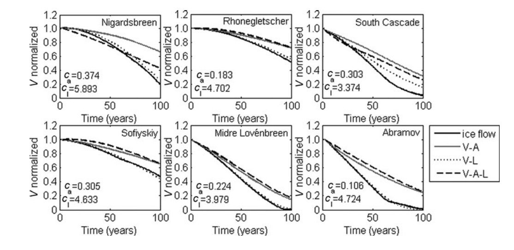

## Analysis of scaling methods in deriving future volume evolutions of valley glaciers

**Valentina Radić, Regine Hock and Johannes Oerlemans (2008) - Journal of Glaciology - http://doi.org/10.3189/002214308786570809**

**Note:** This paper analyzes the application of Radic et al. (2007) to real world glaciers – and again, the correct application of volume/area scaling in conjuncture with the proper response time scaling is missing. However, some of the perks and snags of scaling methods are correctly identified and overall the paper is much more sound and relevant to my work than the first one.

#### **Abstract:**

> [...] analyze the performance of scaling relationships for deriving volume projections in comparison to projections from a one-dimensional ice-flow model. [...] forced by different hypothetical [negative] mass-balance perturbations [...] volume–area (V-A), volume–length (V-L) and volume–area–length (V-A-L) [...] mostly underestimate the volume losses predicted by the ice flow model [...] by the end of the 100 year simulation period. [...] initial [absolute] volumes and [absolute] volume evolutions are highly sensitive to the choice of the scaling constants [...] when normalized by initial volume, volume evolutions are relatively insensitive to the choice of scaling [parameters].

#### Introduction:

Notable citations:

- Raper et al. (2000): first geometric model including volume/area/length scaling and forced by GCM scenarios, computed 21^st^ century glacier ablation to be ~45% less than previously estimated (for constant glacier geometries), in agreement with IPCC AR4 (2007)
- Van de Wal and Wild (2001): comparison between scaling and 1D flowline model on single glaciers, VAS overestimated volume of retreating glaciers up to 20%
- Schneeberger et al. (2003): comparison between scaling and 2D ice flow model for single glaciers, VAS over- and underestimated volume projections, concluding that the average of a large sample is representative (law of large numbers)
- Meier et al. (2003): scaling applied on a global dataset, ~25% error in total volume estimate, up to ~50% for individual glaciers and ice caps
- Pfeffer et al. (1998): synthetic glaciers in steady state based on a pseudo-3D ice flow model to verify the physical derivations by Bahr et al. (1997)

#### Methods:

Four steps:

1. Dynamical calibration of the ice-flow model
2. 100-year evolutions with synthetic climate data (negative mass balance perturbations)
3. Comparison with ice volume projections from the different scaling methods
4. Sensitivity experiments in regard to scaling parameters and mass-balance/elevation feedback

**Investigated glaciers and data**

The following glaciers are selected for this study: Nigardsbreen (outlet glacier in southern Norway), Rhônegletscher (center of Swiss Alps), South Cascade Glacier (Washington State, USA), Sofiyskiy (continental summer-accumulation-type glacier in the Russian Altai Mountains), Midre Lovénbreen (polythermal vally glacier in northwest Svalbard), Abramov glacier (Alay range of Kirgyzstan)

The needed input data (bed and surface topography, historical front/length observations, mass balance) is compiled from a couple of different sources, including the organizations like the WGMS, the Unite States Geological Survey, the Norsk Polarinstitutt, as well as published and unpublished sources.

**Volume evolutions from the ice flow model**

*Model description:* as in Radić et al. (2007) the used ice flow model is by Oerlemanns (1997). The 1D flowline model is solved on a 100 m grid with a time step of 0.005 years (for stability). The trapezoidal cross sections are parametrized from the 3D geometry (bed and surface width $w_b$ and $w_s$) and ice thickness $H$ as
$$
w_b = w_s - 2\tan\theta\,H
$$
where the angle between valley walls and the vertical $\theta$ is estimated from the DEM of the surroundings.

The vertically integrated continuity equation under the assumption of incompressibility and Glen's flow law as constitutive equation reads
$$
\renewcommand{dpar}[2]{\frac{\partial #1}{\partial #2}}

\dpar{S}{t} = -\dpar{(US)}{x} + w_s\dot b,
$$
where $S = H(w_b + w_s)/2$ is the cross sectional area, $U = U_d + U_s$ is the depths-averaged ice velocity determined by internal deformation and sliding as
$$
U = U_d + U_s = f_dH\tau^3 + f_s\frac{\tau^3}{\rho g H}.
$$
The driving stress $\tau$ is proportional to the ice density $\rho$, the gravitational acceleration $g$, the surface slope $\partial h/\partial x$ and the ice thickness $H$. The rightmost term of the continuity equation represents the mass gain or loss by surface width $w_s$ times specific mass balance rate $\dot b$. Substituting the geometric parameterization into the continuity equation and solving for ice thickness $H$ yields the prognostic equation
$$
\dpar{H}{t} = -\frac{1}{w_b + 2\tan\theta\,H} \left((w_b + \tan\theta\,H)\dpar{(UH)}{x} + UH\dpar{(w_b + \tan\theta\,H)}{x}\right) + \dot b
$$
*Dynamical calibration:* ... da fuck?!

*Volume projections:* the volume projections start in the last year of the dynamical calibration ($t_0=0$) by introducing a synthetic negative mass balance perturbation as trend $\Delta b(t) = \Delta b(t_0)t$, with an initial perturbation of $\Delta b(t_0) \in \{-0.005, -0.010, -0.015\}\ \mathrm{ma^{-1}}$.

**Volume evolutions from the scaling methods**

*Scaling relationships:* short summary about scaling relation (Macheret et al. (1988), Chen and Ohmura (1990), Bahr (1997), Bahr et al. (1997)) and discussion about parameter choice for the volume/area and volume/length power law relations:
$$
\begin{equation}
\begin{split}
V = c_a A^\gamma
\end{split}
\qquad \qquad
\begin{split}
V = c_l L^q
\end{split}
\end{equation}
$$
The volume/area scaling exponent $\gamma$ is empirically determined by Chen and Ohmura (1990) to be $\gamma = 1.357$, while Bahr et al. (1997) show the physical origin and determine $\gamma = 1.375$  and $q = 2.2$ based on the Buckingham Pi theorem. Given that the characteristic width scales with characteristic length as $[w] \propto [L]^{0.6}$, the above relations are equivalent. The scaling constants can be assumed to be normally distributed random variables as $c_a \sim \mathcal {N}(0.191\ \mathrm{m^{3-2\gamma}} ,(0.073\ \mathrm{m^{3-2\gamma}})^{2})$ and $c_l \approx ???$.

*Volume projections:* After computing the volume change as product annual area-average net mass balance and surface area $\Delta V = \sum_{i=1}^n b_i(t)a_i(t)$ (the index $i$ denotes the elevation band) and the new volume as $V(t+1) = V(t) + \Delta V(t)$ there are three different methods of updating the total area $A(t+1)$ and the number of elevation bands $n(t+1)$:

1. Volume/area scaling: as in Radić et al. (2007) the new glacier area is derived by inverting the volume/area scaling relation and any change in area occurs at the glaciers tongue (by adding or removing elevation bands). The number of bands is derived from equation $A(t) = \sum_{i=1}^n a_i(t)$.
2. Volume/length scaling: analogous to the previous method, only that the new length is derived by inverting the volume/length scaling relation. The new number of elevation bands is given by the new glacier length divided by the fixed length of glacier bands (100 m). The total glacier area again calculated from $A(t) = \sum_{i=1}^n a_i(t)$. The width of each band is held constant, which alters the length/width scaling exponent over time...
3. Volume/area/length scaling: as one may think it is a combination of both previous methods. The number of elevation bands is calculated using volume/length scaling, while the changes in total area is computed using volume/area scaling. Thereby the shape of the initial glacier area–elevation distribution is conserved, by multiplying the normalized area–elevation distribution with the new total area. This allows area change on all elevation bands and not just in the tongue area.

**Sensitivity experiments**

*Scaling parameters:* ... idk if I should care!

*Mass balance/glacier thickness feedback:* If a glacier is subjected to a positive mass balance it will advance to lower elevations, in turn decreasing the mass balance at the tongue area until a new equilibrium is reached (negative feedback). A different mechanism applies to the glacier thickness, since increasing the ice thickness due to a positive mass balance raises the glacier surface to higher elevations (and most likely increases the surface area), which in turn farther increases the mass balance (positive feedback).

In order to investigate the thickness feedback, the ice thickness in the flowline model is held constant for computation of the mass balance after the calibration phase.

The scaling methods include those feedback mechanisms by changing the area/elevation distribution. To include a mass balance/thickness feedback, the change in mean thickness $H_m(t) = V(t)/A(t)$ from one year to another is added to the surface profile which is used to compute the annual mass balance profile.

#### Results and Discussion

**Scaling methods**

The figure below shows the normalized volume projections for all six glaciers and four models under the –0.015 ma^-1^ mass balance perturbation. As can be seen, the volume/length scaling matches the flowline model best, followed by the volume/area/length scaling and the volume/area scaling. Similar behavior can be seen for the other two mass balance perturbations. Overall, the scaling methods underestimate the volume loss by a maximum of 18%, 32% and 47% for the volume/length scaling, volume/area/length scaling and the volume/area scaling, respectively.

Some attempted explanations argue wrongly, that scaling would use the assumption of perfect plasticity and work only under steady state conditions (neglecting that the proper response time scaling was not applied by the authors themselves). However, the limitations of the 1D model are acknowledged, among them especially the fact that certain parametrization may violate the physics and closure conditions on which the scaling approach depends.

Other sources of error are the differences in the length and area change between the flowline model and the scaling methods. The flowline model parametrizes the width (and thereby the area) of each elevation band as a function of thickness. While this allows the area to shrink and grow along the entire glacier, the glacier lengths shrinks only when the thickness in the lowermost elevation band reaches zero. This results in a thin terminus with a relatively large area and hence, a stronger negative mass balance. The volume/area scaling removes area (or length) only at the terminus, hence by removing the lower-lying elevation bands the mass balance gets less negative. Analogously, the volume/length scaling removes area (or length) only at the terminus, however the removal occurs much slower and obviously matches the flowline model best. The volume/area/length scaling methods allows the area to change along the entire glacier, while keeping the shape of the area/elevation distribution preserved. This results in less area per elevation band compared to the flowline model and inhibits the maximum reduction of thickness and area at the glacier terminus.

**Sensitivity to scaling exponents**

In a nutshell: as shown by Radic et al. (2007) for synthetic glaciers, the normalized volume projections by scaling methods are rather insensitive to the changes in the scaling exponent

**Sensitivity to scaling constant**

...

**Mass balance/thickness feedback**

Excluding the mass balance/thickness feedback from the flowline model to an underestimation (2-14%) of the 100 year projected volume loss – this is to be expected, since lowering the surface leads to a decrease in mass balance. Including the mass balance/thickness feedback in the scaling methods leads to a better result (closer to the flowline model), but only by a few percent.

#### **Conclusions:**

In general, the scaling methods underestimate the normalized volume loss, in comparison to the flowline model, for all three trend-like negative mass balance perturbations (-0.005, -0.010 and -0.015 ma^-1^). The least deviation of 18% of initial volume resulted from the volume/length scaling, while volume/area scaling and volume/area/length scaling resulted in differences of around 47% to 32%, respectively.

While the absolute values of initial and projected volumes are highly sensitive to the chosen scaling constant, normalized by initial volume future projects are fairly robust and insensitive to the choice of scaling constant and/or scaling exponent.