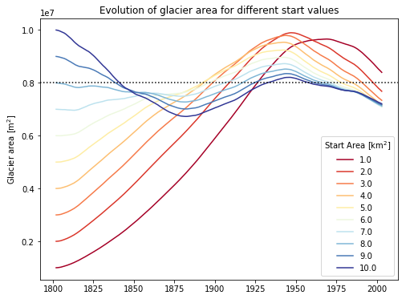
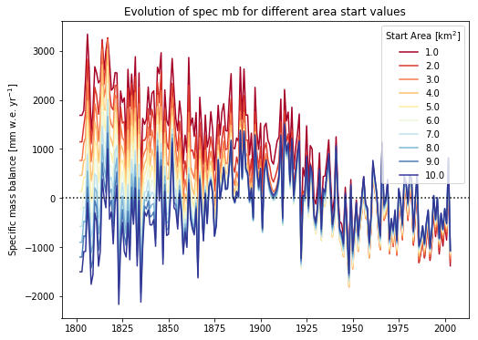

# Iterative computation of glacier surface area at the beginning of the model integration

Ok... lets see what I did and why it doesn't work.

## Explaining the idea behind the code

```python
# import externals libs
import os
import shutil
import numpy as np
import pandas as pd
import geopandas as gpd

# import the needed OGGM modules
import oggm
from oggm import cfg
from oggm.utils import get_demo_file, get_rgi_glacier_entities
from oggm.tests.funcs import get_test_dir
from oggm.core import gis, climate, centerlines, vascaling
```

Importing all the needed external libs and OGGM modules.

```python
# ---------------------
#  PREPROCESSING TASKS
# ---------------------

# create test directory
testdir = os.path.join(get_test_dir(), 'tmp_comparison')
if not os.path.exists(testdir):
    os.makedirs(testdir)
shutil.rmtree(testdir)
os.makedirs(testdir)

# load default parameter file
cfg.initialize()
cfg.set_intersects_db(get_demo_file('rgi_intersect_oetztal.shp'))
cfg.PATHS['working_dir'] = testdir
cfg.PATHS['dem_file'] = get_demo_file('hef_srtm.tif')
cfg.PATHS['climate_file'] = get_demo_file('histalp_merged_hef.nc')
cfg.PARAMS['border'] = 10
cfg.PARAMS['run_mb_calibration'] = True
cfg.PARAMS['baseline_climate'] = ''
cfg.PARAMS['use_multiprocessing'] = True

# read the Hintereisferner DEM
hef_file = get_demo_file('Hintereisferner_RGI5.shp')
entity = gpd.read_file(hef_file).iloc[0]

# initialize the GlacierDirectory
gdir = oggm.GlacierDirectory(entity, base_dir=testdir)
# define the local grid and glacier mask
gis.define_glacier_region(gdir, entity=entity)
gis.glacier_masks(gdir)

# process the given climate file
climate.process_custom_climate_data(gdir)

# run center line preprocessing tasks
centerlines.compute_centerlines(gdir)
centerlines.initialize_flowlines(gdir)
centerlines.compute_downstream_line(gdir)
centerlines.compute_downstream_bedshape(gdir)
centerlines.catchment_area(gdir)
centerlines.catchment_intersections(gdir)
centerlines.catchment_width_geom(gdir)
centerlines.catchment_width_correction(gdir)

# read reference glacier mass balance data
mbdf = gdir.get_ref_mb_data()
# compute the reference t* for the glacier
# given the reference of mass balance measurements
res = climate.t_star_from_refmb(gdir, mbdf=mbdf['ANNUAL_BALANCE'])
t_star, bias = res['t_star'], res['bias']
```

Preprocessing including the GIS tasks, climate tasks and center line tasks. The $t^*​$ and $\beta^*​$ are read from the reference mass balance table, in order to compute the $\mu^*​$.

```python
# --------------------
#  SCALING MODEL
# --------------------

# compute local t* and the corresponding mu*
vascaling.local_t_star(gdir, tstar=t_star, bias=bias)

# instance the mass balance models
ben_mbmod = vascaling.VAScalingMassBalance(gdir)
```

As mentioned above, the temperature sensitivity $\mu^*$ is computed using the $t^*$ and $\beta^*$ from the reference mass balance table. Given a successful $\mu^*$ calibration, the mass balance model is set up.

```python
# get reference area
a0 = gdir.rgi_area_m2
# get reference year
rgi_df = get_rgi_glacier_entities([gdir.rgi_id])
y0 = int(rgi_df.BgnDate.values[0][:4])
# get min and max glacier surface elevation
h0, h1 = vascaling.get_min_max_elevation(gdir)
```

The starting value for the glacier surface area and the corresponding year are given by the RGI entry, while the minimum and maximum glacier surface elevation are computed using the DEM.

```python
# set up the glacier model with the values of 2003
model_ref = vascaling.VAScalingModel(year_0=y0, area_m2_0=a0,
                                     min_hgt=h0, max_hgt=h1,
                                     mb_model=ben_mbmod)
```

The reference model `model_ref` is set up with the observed/measured values from 2003, in order to compare the result of the model evolution and to ultimately find the *best* starting surface area.

```python
# instance first guess areas
a_min = 1
a_max = 10
num = 10
area_guess = np.linspace(a_min, a_max, num, endpoint=True)*1e6
#area_guess = [model_ref.area_m2_0]
iteration_list = list()
spec_mb_list = list()

# iterate over all starting areas
for area in area_guess:
    # instance iteration model
    model_guess = vascaling.VAScalingModel(year_0=y0, area_m2_0=a0,
                                           min_hgt=h0, max_hgt=h1,
                                           mb_model=ben_mbmod)
    # set new starting values
    model_guess.create_start_glacier(area, year_start=1802)
    # run model and save years and area
    _years, _, _area, _, _spec_mb = model_guess.run_until(year_end=model_ref.year)
    # create series and store in container
    iteration_list.append(pd.Series(_area, index=_years))
    spec_mb_list.append(pd.Series(_spec_mb, index=_years))
```

I'll start with a set of ten different starting values between $1$ and $10\ \mathrm{km}^2$ for the surface area. For each values I set up a glacier model and let it evolve until the year 2003 with the same HistAlp climate data.

##Results and interpretations

The *raw* results are compiled into a single `pandas` data frame, which allows for easier comparison. The outcome is far from what I expected, and I guess that it is much more a programming issue than a weird behaving glacier. Interestingly enough, the smaller the starting surface area in 1802, the bigger the glacier gets in the first 150ish years and ends with the larges surface area in the year 2003. **At first, this seemed odd to me...**



Accordingly, the specific mass balance (given in $\mathrm{mm\ w.e.\ yr^{-1}}$) is higher (and positive) for smaller glacier and lower (and negative) for the bigger ones. After about 150 years, all models show similar values for their respective specific mass balance.



**Attempting an explanation:** First I thought that those results are just plane wrong, since I'd expected the exact opposite. But while I'm writing this it occurs to me, that it is actually not so far off... The terminus elevation will increase given a smaller starting surface area, since the maximum elevation is held constant. Therefore the average surface temperature will be lower, which results in less energy input (in form of positive melting temperature) and comparatively more solid precipitation (or at least an equal amount). Less melting and more (or equal) snow fall, for short. Hence, higher (and positive) specific mass balance.

## Questions

Current issues regarding the iteration problem:

- [ ] Do my thoughts make sense?!

  Yes, at least I think so. Obviously, the computed starting area does not correspond to the actual glacier surface are in 1850. However, according to Fabi, those results are in line with the general model behaviour...

- [ ] Where can I get Hintereisferner reference data?!

  The WGMS/GLIMS archive has outlines for different years, with length, area and similar parameters.

- [ ] Intelligent iteration?! -> use `scipy.minimize()`

Other questions:

- [x] Computing the reference $t^*$ list...
- [ ] Ideas for experiments leading to the poster/AGM...