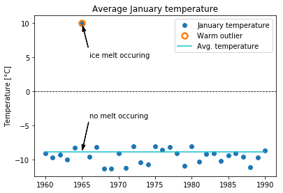
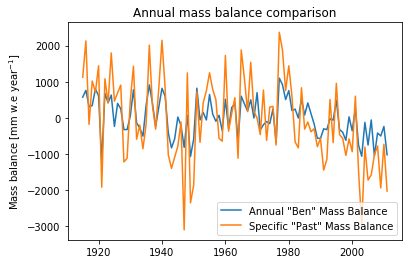
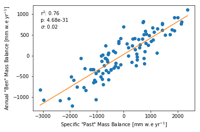
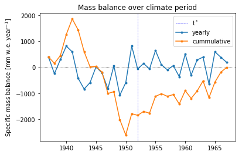

# Implementation of the volume/area scaling (VAS) model

The idea was born at the *OGGM/ACINN Hacktoberfest* and is (hopefully) an essential part of my future Masters thesis.

This serves me as some sort of scientific journal. Here I will note ideas, progress and problems in a more clear way than in my several notebooks, loose sheets of papers and used napkins.

**Content:**

1. Calibration of $\mu^*$
2. Testing the $\mu_*$ calibration
3. Mass balance model(s)
4. Testing the mass balance model
5. ... lot's of stuff that is missing (since I'm a lazy f*cker)
6. Getting back into the saddle - Nov 19

## Calibration of $\mu^*$

Using a different mass balance model calls for a different calibration of the temperature sensitivity $\mu^*$. For the moment I used the provided reference list of $t^*$ for all glaciers with mass balance measurements, and started with the computation of the local $t^*$ and the corresponding glacier wide $\mu^*$.

###Terminus temperature and solid precipitation

The calibration between the OGGM and the simpler model of [Marzeion et. al., 2010](http://www.marzeion.info/sites/default/files/marzeion_etal_12a.pdf) differs mainly in the computation of the used climatological parameters. At least that is what I figured... The OGGM tasks consider the glacier as a whole, averaging positive melting temperature and solid precipitation over the entire glacier surface. The simple model only uses the monthly mean temperature at the glacier terminus $T_i^\text{terminus}$ as driver for mass loss, given by 
$$
T_i^\text{terminus} = T_i^\text{input} + \gamma_\text{temp} \cdot (z_\text{terminus} - z_\text{ref}) + T_i^\text{anom}.
$$
The climatological input temperature $T_i^\text{input}$  is changed via an (adiabatic) lapse rate $\gamma_\text{temp}$, depending on the elevation difference between the glacier terminus $z_\text{terminus}$ and the input reference point $z_\text{ref}$. A monthly mean temperature anomaly $T_i^\text{anom}$ can be added.

```python
def _compute_temp_terminus(temp, temp_grad, ref_hgt, terminus_hgt, temp_anomaly=0):
    """ Computes the monthly mean temperature at the glacier terminus.

    :param temp: (netCDF4 variable) monthly mean climatological temperature
    :param temp_grad: (netCDF4 variable or float) temperature lapse rate
    :param ref_hgt: (float) reference elevation for climatological temperature
    :param terminus_hgt: (float) elevation of the glacier terminus
    :param temp_anomaly: (netCDF4 variable or float) monthly mean temperature
    	anomaly, default 0

    :return: (netCDF4 variable) monthly mean temperature at the glacier terminus
    """
    temp_terminus = temp + temp_grad * (terminus_hgt - ref_hgt) + temp_anomaly
    return temp_terminus
```

The internal function `_compute_temp_terminus(...)` is the implementation of the above specified formula.

The area mean monthly solid precipitation onto the glacier surface $P_i^\text{solid}$ is given by
$$
P_i^\text{solid} = (a \cdot P_i^\text{input} + P_i^\text{anom}) \cdot (1+ \gamma_\text{prcp}\cdot(z_\text{mean} - z_\text{ref})) \cdot f_\text{solid}.
$$
Hereby, the sum of the climatological input precipitation $P_i^\text{input}$ (scaled by the precipitation scaling parameter $a$) and the monthly precipitation anomaly $P_i^\text{anom}$ are changed via the precipitation lapse rate $\gamma_\text{prcp}$, depending on the difference between the mean glacier elevation $z_\text{mean}$ and the input reference elevation $z_\text{ref}$. Only solid precipitation (snow) is accounted for accumulation, whereby the fraction of solid precipitation is based on the monthly mean terminus temperature $T_i^\text{terminus}$ as
$$
f_\text{solid} = 
\begin{cases}
0 \qquad \text{... if} \quad T_i^{z_\text{max}} \geq T^\text{prec solid} \\
1 \qquad \text{... if} \quad T^\text{prec solid} \geq T_i^\text{terminus}\\
1 + \frac{T_i^\text{terminus} - T^\text{prec solid}}{\gamma_\text{temp} (z_\text{max} - z_\text{terminus})} \quad \text{... otherwise}

\end{cases}
$$
If the temperature at the glacier high point $T_i^{z_\text{max}}$ exceeds the threshold for solid precipitation $T^\text{prec solid}$ all fallen precipitation is assumed to be liquid ($f_\text{solid} = 0$). On the other hand, If the temperature at the glacier terminus $T_i^\text{terminus}$ is below the threshold for solid precipitation $T^\text{prec solid}$ all fallen precipitation is assumed to be solid ($f_\text{solid} = 1$). The scaling factor is linearly interpolated between 0 and 1 , for all cases between the two extremes.

```python
def _compute_solid_prcp(prcp, prcp_factor, ref_hgt, min_hgt, max_hgt,
                        temp_terminus, temp_all_solid, temp_grad,
                        prcp_grad=0, prcp_anomaly=0):
    """

    :param prcp: (netCDF4 variable) monthly mean climatological precipitation
    :param prcp_factor: (float) precipitation scaling factor
    :param ref_hgt: (float) reference elevation for climatological precipitation
    :param min_hgt: (float) minimum glacier elevation
    :param max_hgt: (float) maximum glacier elevation
    :param temp_terminus: (netCDF4 variable) monthly mean temperature 
    	at the glacier terminus
    :param temp_all_solid: (float) temperature threshold for solid precipitation
    :param temp_grad: (netCDF4 variable or float) temperature lapse rate
    :param prcp_grad: (netCDF4 variable or float) precipitation gradient
    :param prcp_anomaly: (netCDF4 variable or float) monthly mean precipitation
    	anomaly, default 0

    :return: (netCDF4 variable) monthly mean solid precipitation
    """
    # compute fraction of solid precipitation
    f_solid = 1 + (temp_terminus - temp_all_solid) / (temp_grad * (max_hgt - min_hgt))
    f_solid = np.clip(f_solid, 0, 1)

    # compute mean elevation
    mean_hgt = 0.5 * (min_hgt + max_hgt)
    # apply precipitation scaling factor
    prcp_solid = (prcp_factor * prcp + prcp_anomaly)
    # compute solid precipitation
    prcp_solid *= (1 + prcp_grad * (mean_hgt - ref_hgt)) * f_solid

    return prcp_solid
```

The internal function `_compute_solid_prcp(...)` is the implementation of the above specified formula.

### Monthly climatological values

**Important note:** Turns out, that is not the right way to do it. Which is why it is implemented differently in the OGGM. The calculations are correct, but the train of thought is corrupted. See next section *Yearly climatological values* for details.

Given a $t^*$, the temperature sensitivity $\mu^*$ is than determined by solving the following equation for $\mu^*$ 
$$
B = \left[\sum_{i=1}^{12}\left[
			P(t^*)_{i,\text{ clim}}^{\text{solid}} 
			- \mu^* \cdot
					\max\left(T(t^*)_{i,\text{ clim}}^{\text{terminus}}
					- T_{\text{melt}},\ 0\right)
	\right]\right] = 0.
$$
Hence, the temperature sensitivity $\mu^*$ is chosen, so that the calculated mass balance equals zero, using the monthly climatological values around $t^*$ of solid precipitation and temperature as input,  $P(t^*)_{i,\text{ clim}}^{\text{solid}}$ and $T(t^*)_{i,\text{ clim}}^{\text{terminus}}$ respectively. The function `get_climatological_prcp_temp(...)` returns said climatological values for temperature and precipitation.

```python
def get_climatological_prcp_temp(gdir, time_range=None, year_range=None):
    """ Get the monthly climatological values of terminus temperature and solid
    precipitation for the given time range.

    :param gdir: (oggm.GlacierDirectory)
    :param time_range: ([datetime, datetime]), optional
        default is to read all data but with this you
        can provide a [t0, t1] bounds (inclusive).
    :param year_range: ([int, int]), optional
        Provide a [y0, y1] year range to get the data for specific
        (hydrological) years only. Easier to use than the time bounds above.
    
    :return [months, temp_terminus_clim, prcp_solid_clim]: 
    	months ([int]): the months as index (basically just an array from 1 to 12)
    	temp_terminus_clim ([float]): monthly climatological values of terminus
        	temperature over the given time range
     	prcp_solid_clim ([float]): monthly climatological values solid precipitation
     		over the given time range
    """
```

The only needed input is the `GlacierDirectory`, but a year `year_range` or time range `time_range` must be supplied to limit the output to the climatological period centred around $t^*$.

```python
    if year_range is not None:
        sm = cfg.PARAMS['hydro_month_' + gdir.hemisphere]
        em = sm - 1 if (sm > 1) else 12
        t0 = datetime.datetime(year_range[0]-1, sm, 1)
        t1 = datetime.datetime(year_range[1], em, 1)
        return get_climatological_prcp_temp(gdir, time_range=[t0, t1])

    # Parameters
    temp_all_solid = cfg.PARAMS['temp_all_solid']
    prcp_fac = cfg.PARAMS['prcp_scaling_factor']
    default_grad = cfg.PARAMS['temp_default_gradient']
    grad_prcp = 3e-4
    g_minmax = cfg.PARAMS['temp_local_gradient_bounds']

    # Read file
    igrad = None
    with utils.ncDataset(gdir.get_filepath('climate_monthly'), mode='r') as nc:
        # time
        time = nc.variables['time']
        time = netCDF4.num2date(time[:], time.units)
        if time_range is not None:
            p0 = np.where(time == time_range[0])[0]
            try:
                p0 = p0[0]
            except IndexError:
                raise climate.MassBalanceCalibrationError('time_range[0] not found in '
                                                          'file')
            p1 = np.where(time == time_range[1])[0]
            try:
                p1 = p1[0]
            except IndexError:
                raise climate.MassBalanceCalibrationError('time_range[1] not found in '
                                                          'file')
        else:
            p0 = 0
            p1 = len(time)-1

        time = time[p0:p1+1]

        # Read timeseries
        itemp = nc.variables['temp'][p0:p1+1]
        iprcp = nc.variables['prcp'][p0:p1+1]
        if 'gradient' in nc.variables:
            igrad = nc.variables['gradient'][p0:p1+1]
            # Security for stuff that can happen with local gradients
            igrad = np.where(~np.isfinite(igrad), default_grad, igrad)
            igrad = np.clip(igrad, g_minmax[0], g_minmax[1])
        ref_hgt = nc.ref_hgt

    # Default gradient?
    if igrad is None:
        igrad = itemp * 0 + default_grad

```

This code block is identical to the OGGM template `mb_climate_on_height(gdir, heights)`, sor far so good. It reads the climate file and prepares the time series for input temperature `itemp`, input precipitation `iprcp`, temperature gradient `igrad`, as well as the needed parameters such as temperature thresholds, reference elevation, ...

```python
    # The following is my code. So abandon all hope, you who enter here.

    # get temperature at glacier terminus
    temp_terminus = _compute_temp_terminus(itemp, igrad, ref_hgt, min_hgt)
    # get solid precipitation
    prcp_solid = _compute_solid_prcp(iprcp, prcp_fac, ref_hgt, min_hgt, max_hgt,
                                     temp_terminus, temp_all_solid, igrad)
```

Here I'm using the implementation of the above defined formulas for the calculation of terminus temperature and solid temperature to get said values.

```python
    # compute climatological values
    months = np.arange(1, 13)
    temp_terminus_clim = months * 0
    prcp_solid_clim = months * 0
    for month in months:
        # get location
        pos = [t.month == month for t in time]
        # compute average over all months
        prcp_solid_clim[month - 1] = np.mean(prcp_solid[pos])
        temp_terminus_clim[month - 1] = np.mean(temp_terminus[pos])

    return months, temp_terminus_clim, prcp_solid_clim
```

Given the monthly time series, the climatological monthly values are computed by averaging over all mean values of a certain month, which are than returned alongside the monthly index `months`. For clarity: the returned arrays contain twelve values, one per months. 

### Yearly climatological values

As mentioned above, using monthly climatological values (as in the average January temperature) is not the correct way to compute the mass balance. Imagine a hypothetical time series of average January temperature over 31 years. The average Januar temperature is around -10°C for each year, except for a particularly warm year where it was +10°C. The climatological temperature for this period will therefore be close to -10°C or at least below zero, so no melt occurs in January. But that one warm January with highly positive temperatures has definitely caused some ice melt, which is not covered within the climatological value.



Therefore we use a yearly sum of positive melting temperature and solid precipitation, so the mass input/loss of each month will be counted.

@TODO: explain code

### Glacier wide temperature sensitivity

The last step is to actually compute temperature sensitivity $\mu^*$, now that all climatological parameters are available. But to do so, a glacier specific $t^*$ is needed. Both tasks are covered by the `local_t_star(gdir)` function, which is largely based on the OGGM template. It is also the only  function to be called by the user.

```python
def local_t_star(gdir, *, ref_df=None, tstar=None, bias=None):
    """Compute the local t* and associated glacier-wide mu*.

    If ``tstar`` and ``bias`` are not provided, they will be interpolated from
    the reference t* list.

    Note: the glacier wide mu* is here just for indication. It might be
    different from the flowlines' mu* in some cases.

    Parameters
    ----------
    gdir : oggm.GlacierDirectory
    ref_df : pd.Dataframe, optional
        replace the default calibration list with your own.
    tstar: int, optional
        the year where the glacier should be equilibrium
    bias: float, optional
        the associated reference bias
    """
    
    # Relevant mb params
    params = ['temp_default_gradient', 'temp_all_solid', 'temp_all_liq',
              'temp_melt', 'prcp_scaling_factor']

    if tstar is None or bias is None:
	    # Do our own interpolation of t_start for given glacier
        if ref_df is None:
            if not cfg.PARAMS['run_mb_calibration']:
                # Make some checks and use the default one
                climate_info = gdir.read_pickle('climate_info')
                source = climate_info['baseline_climate_source']
                ok_source = ['CRU TS4.01', 'CRU TS3.23', 'HISTALP']
                if not np.any(s in source.upper() for s in ok_source):
                    msg = ('If you are using a custom climate file you should '
                           'run your own MB calibration.')
                    raise climate.MassBalanceCalibrationError(msg)
                v = gdir.rgi_version[0]  # major version relevant

                # Check that the params are fine
                str_s = 'cru4' if 'CRU' in source else 'histalp'
                vn = 'ref_tstars_rgi{}_{}_calib_params'.format(v, str_s)
                for k in params:
                    if cfg.PARAMS[k] != cfg.PARAMS[vn][k]:
                        raise ValueError('The reference t* you are trying '
                                         'to use was calibrated with '
                                         'difference MB parameters. You '
                                         'might have to run the calibration '
                                         'manually.')
                ref_df = cfg.PARAMS['ref_tstars_rgi{}_{}'.format(v, str_s)]
            else:
                # Use the the local calibration
                fp = os.path.join(cfg.PATHS['working_dir'], 'ref_tstars.csv')
                ref_df = pd.read_csv(fp)

        # Compute the distance to each glacier
        distances = utils.haversine(gdir.cenlon, gdir.cenlat,
                                    ref_df.lon, ref_df.lat)

        # Take the 10 closest
        aso = np.argsort(distances)[0:9]
        amin = ref_df.iloc[aso]
        distances = distances[aso]**2

        # If really close no need to divide, else weighted average
        if distances.iloc[0] <= 0.1:
            tstar = amin.tstar.iloc[0]
            bias = amin.bias.iloc[0]
        else:
            tstar = int(np.average(amin.tstar, weights=1./distances))
            bias = np.average(amin.bias, weights=1./distances)

    # Add the climate related params to the GlacierDir to make sure
    # other tools cannot fool around without re-calibration
    out = gdir.read_pickle('climate_info')
    out['mb_calib_params'] = {k: cfg.PARAMS[k] for k in params}
    gdir.write_pickle(out, 'climate_info')
    
    # We compute the overall mu* here but this is mostly for testing
    # Climate period
    mu_hp = int(cfg.PARAMS['mu_star_halfperiod'])
    yr = [tstar - mu_hp, tstar + mu_hp]
```

The above code fragment is identical to the OGGM task, so far so good (a detailed description can be found in the `understand_calibration.md` file). If $t^*$ and $\beta^*$ are not supplied, said values are interpolated from the (given) reference table. On success, the mass balance calibration parameters (including temperature thresholds and precipitation scaling factor ) are written into the `climate_info.pkl` file. Next step is to compute the 31-year range of the climatological period centred around $t^*$.

```python
    # get relevant elevation information
    fpath = gdir.get_filepath('gridded_data')
    with ncDataset(fpath) as nc:
        mask = nc.variables['glacier_mask'][:]
        topo = nc.variables['topo'][:]
    dem_min_elev = np.min(topo[np.where(mask == 1)])
    dem_max_elev = np.max(topo[np.where(mask == 1)])
```
This is the first block where my code differs from its OGGM template. The minimal and the maximal glacier surface elevation are needed to estimate the correct climatological parameters such as the area mean monthly solid precipitation onto the glacier surface $P_i^{\text{solid}}$ and the monthly mean air temperature at the location and elevation of the terminus of the glacier $T_i^{\text{terminus}}$. This information is gathered from the gridded topography file.

```python
    # get monthly climatological values of terminus temperature and solid precipitation
    _, temp_terminus, prcp_solid = get_climatological_prcp_temp(gdir,
                                                                dem_min_elev,
                                                                dem_max_elev,
                                                                year_range=yr)
```

The climatological values of said parameters are computed using the `get_climatological_prcp_temp()` function, as explained above.

```python
    # Do we have a calving glacier?
    cmb = climate.calving_mb(gdir)
```

On tidewater glaciers a substantial amount of ablation occurs via calving, it must be considered during the calibration process. The task `climate.calving_mb(gdir)` returns the calving mass loss for the given glacier in specific mass balance equivalent units $\mathrm{[mm\ yr^{-1}]}$. 

```python
	# compute positive 'melting' temperature/energy input
    temp = np.clip(temp_terminus - cfg.PARAMS['temp_melt'], a_min=0, a_max=None)
	# TODO: Have I included calving mass balance at the right spot?! Units?!
    # solve mass balance equation for mu*
    mustar = (sum(prcp_solid) - cmb) / sum(temp)
```

The temperature sensitivity is computed by solving the following equation for $\mu^*$
$$
B = \left[\sum_{i=1}^{12}\left[
			P(t^*)_{i,\text{ clim}}^{\text{solid}} 
			- \mu^* \cdot
					\max\left(T(t^*)_{i,\text{ clim}}^{\text{terminus}}
					- T_{\text{melt}},\ 0\right)
	\right]\right] = 0.
$$

```python
	if not np.isfinite(mustar):
        raise climate.MassBalanceCalibrationError('{} has a non finite '
                                                  'mu'.format(gdir.rgi_id))

    # Clip the mu
    if not (cfg.PARAMS['min_mu_star'] < mustar < cfg.PARAMS['max_mu_star']):
        raise climate.MassBalanceCalibrationError('mu* out of specified bounds.')
```

Some quality control, wether the computed $\mu^*$ is finite and lies within the specified boundaries.

```python
    # Scalars in a small dict for later
    df = dict()
    df['rgi_id'] = gdir.rgi_id
    df['t_star'] = int(tstar)
    df['bias'] = bias
    df['mu_star'] = mustar
    gdir.write_json(df, 'ben_params')
```

The following parameters are stored in the `ben_params.json` file, making them accessible to other tasks:

- `rgi_id` is the RGI ID in order to identify the glacier
- `t_start` is most obviously $t^*$
- `bias` is most obviously the bias $\beta^*$
- `mu_star` is the glacier wide temperature sensitivity $\mu^*$


## Testing the $\mu^*$ calibration

So far that's all well and good... but no idea wether it works correctly or not. So what about some testing?!

### OGGM's climate unit tests

A good starting point are probably the OGGM `test_prepro.py` test, especially the methods of the `TestClimate` class. Said class is a child of `unittest.TestCase`.

Some **administrative methods** must be provided, in order to correctly initialise the unit test.

- `setUp()` is called to prepare the test fixture. It sets the path, creates and cleans two temporary test directories (`testdir` and `testdir_cru`). The method loads the OGGM default parameter file `PARAMS.cfg`. Hereby the paths for the intersection data base, the working directory, the digital elevation model for Hintereisferner and the HistAlp climate file are set. The `border` is set to 10 pixels, the mass balance calibration is set to `True` and the `baseline_climate` is not set.
- `tearDown()` is called immediately after the test method has been called and the result recorded. It removes the test directories.
- `rm_dir()` removes the test directories.
- `clean_dir()` cleans the test directories.

The following methods test the **climate distribution tasks** for different setting. @TODO

- `test_distribute_climate()`
- `test_distribute_climate_grad()`
- `test_distribute_climate_parallel()`
- `test_distribute_climate_cru()`
- `test_distribute_climate_hsitalp()`

The following methods test different tasks related to the **$\mu^*$ calibration process**: @TODO

- `test_mb_climate()` tests the `mb_climate_on_height(gdir, heights)` function. Said function reads the climate file and computes the monthly mass balance relevant climate parameters at given elevation levels, such as positive melting temperature and solid precipitation. The tests are performed on the Hintereisferner using the HistAlp climate data, for three different settings:

         - all (climate) data points available
         - only one year (1802)
         - only two years (1803 - 1804)

       For each setting all of the following cases are tested:

       - shape of returned values (one value per month and elevation level)
       - returned melting temperature at reference elevation in comparison to reference temperature
       - same results for same elevation levels
       - only solid precipitation given a high elevation (8000 m) i.e. subzero temperatures
       - zero solid precipitation given a low elevation (-8000 m) i.e. highly positive temperatures
       - zero melting temperature given a high elevation (8000 m) i.e. subzero temperatures

- `test_yearly_mb_climate()` tests the `mb_yearly_climate_on_height(gdir, heights, flatten=False)` function. Said function computes the yearly sums of the mass balance relevant climate parameters. The same test as above are performed, once for the given elevation levels (`flatten=False`) and as a glacier average (`flatten=True`).

- `test_mu_candidates()`

- `test_find_tstarts()`

- `test_find_tstarts_multiple_mus()`

- `test_local_t_star()` tests the `local_t_star(gdir)` function, which computes the glacier specific $t^*$ and the corresponding glacier wide temperature sensitivity $\mu^*$, as well as the `mu_star_calibration(gdir)` function, which computes the $\mu^*$ for each flow line and the associated apparent mass balance.

     In addition to the regular preprocessing tasks of loading the DEM, initialising the GlacierDirectory, defining the local grid and the glacier mask, the glacier center (flow) lines and corresponding geometries are computed.

     The recursive $\mu^*$ calibration for each flow line requires the flux through the last grid point of the main flow line to be near zero and the glacier wide apparent mass balance to be zero. Additionally, the $\mu^*$ value of each flow line, the average value over all flow lines and the glacier wide value must be equal (to the third decimal digit) to the reference $\mu^*_\text{ref}$. Thereby, the $\mu$-candidate at $t^*$ is used as glacier wide reference value (stored in the `climate_info.pkl` file).

     The second quality control relies on the observed mass balance gradient, which is only available for certain reference glaciers. The slope is computed via a linear regression, using all point mass balance values for each grid point of each flow line (for elevations below 3'100 m asl.). @TODO: rephrase, this is not even close to English, much less understandable.

**Note**: I'm not sure, wether such a unit test is the best way to control the functionality of my code. It seems as if the test runs the exact same calculation as the tested function, whereby the result is most obviously the same. But than on the other hand, I'm probably just not smart enough to see the power of unit testing...

**Edit**: @TODO: write down stuff I discussed with Fabi about testing 

### Setting up a test case

As mentioned above I'm not entirely sure how to use the unit test framework for this specific task. So here are some ideas which could be moulded into some sort of unit test.

- The internal functions computing the terminus temperature `_compute_temp_terminus(...)` and the solid precipitation `_compute_prcp_solid(...)` can be tested in analogy to `test_mb_climate_on_height()`,  i.e. at reference elevation and for extreme cases (no melt, no solid precipitation, only solid precipitation, ...)


Additionally I'll run some qualitative test in a Jupyter notebook, plot some time series, ... and maybe I'll come up with a structured testing regime on the go...

Since I tried to construct as small code blocks as possible, the test of said blocks is pretty straight forward. This is especially true for the routine computing the terminus temperature and the fraction of solid precipitation. In practice, the zero and extreme cases are tested.

The overreaching routine `get_yearly_mb_temp_prcp()` computing the mass balance relevant climate parameters is tested against the corresponding OGGM routine `get_yearly_mb_climate_on_glacier()`. Testing goals are arbitrary defined correlation values.

Somewhat more complex is the test regarding the $\mu^*$ calibration. The cumulative specific mass balance over the 31-year climate period centred around $t^*$ must be zero, given a successful $\mu^*$ calibration. Thereby the mass balance bias $\beta^*$ is not applied. This test uses the `get_specific_mb()` function of the mass balance model.

### Running the test

All tests (now) run through, without any assertion errors.

## Mass balance model

The different mass balance models are implemented as classes in the OGGM. The `MassBalanceModel` acts as interface, defining necessary methods computing monthly and yearly point mass balances, yearly specific mass balance and the equilibrium line altitude. The `PastMassBalance` model is the most "hands on" model, using (historic) climate data to compute the glacier mass balance.

### `MassBalanceModel` interface

The abstract class `MassBalanceModel` works as interface, defining the necessary methods all other mass balance models must implement.

```python
class MassBalanceModel(object, metaclass=SuperclassMeta):
    """Common logic for the mass balance models.

    All mass-balance models should implement this interface.

    Attributes
    ----------
    valid_bounds : [float, float]
        The altitudinal bounds where the MassBalanceModel is valid. This is
        necessary for automated ELA search.
    """

    def __init__(self):
        """ Initialize."""
        self.valid_bounds = None
        self.rho = cfg.PARAMS['ice_density']
```

The initialiser `__init__()` sets the altitudinal bounds where the mass balance model is valid (`valid_bounds`) and the ice density (`rho`) as instance variables.

#### Point mass balance

```python
    def get_monthly_mb(self, heights, year=None, fl_id=None):
        """Monthly mass-balance at given altitude(s) for a moment in time.

        Units: [m s-1], or meters of ice per second

        Note: `year` is optional because some simpler models have no time
        component.

        Parameters
        ----------
        heights: ndarray
            the atitudes at which the mass-balance will be computed
        year: float, optional
            the time (in the "hydrological floating year" convention)
        fl_id: float, optional
            the index of the flowline in the fls array (might be ignored
            by some MB models)

        Returns
        -------
        the mass-balance (same dim as `heights`) (units: [m s-1])
        """
        raise NotImplementedError()
        
	def get_annual_mb(self, heights, year=None, fl_id=None):
        """Like `self.get_monthly_mb()`, but for annual MB.

        For some simpler mass-balance models ``get_monthly_mb()` and
        `get_annual_mb()`` can be equivalent.

        Units: [m s-1], or meters of ice per second

        Note: `year` is optional because some simpler models have no time
        component.

        Parameters
        ----------
        heights: ndarray
            the atitudes at which the mass-balance will be computed
        year: float, optional
            the time (in the "floating year" convention)
        fl_id: float, optional
            the index of the flowline in the fls array (might be ignored
            by some MB models)

        Returns
        -------
        the mass-balance (same dim as `heights`) (units: [m s-1])
        """
        raise NotImplementedError()
```

Every mass balance model must implement a `get_monthly_mb(...)` method, which computes the average monthly mass balance at given altitudes `heights`. It is possible to supply a moment in time `year` in the "hydrological floating year" convention.  Additionally, the index of the flow line `fl_id` in the flow lines array can be specified if necessary. The returned mass balance comes in SI units of meters of ice per second. 

Analogously, the `get_yearly_mb(...)` returns the average yearly point mass balance value.

#### Specific mass balance and ELA

```python
    def get_specific_mb(self, heights=None, widths=None, fls=None,
                        year=None):
        """Specific mb for this year and a specific glacier geometry.

         Units: [mm w.e. yr-1], or millimeter water equivalent per year

        Parameters
        ----------
        heights: ndarray
            the atitudes at which the mass-balance will be computed.
            Overridden by ``fls`` if provided
        widths: ndarray
            the widths of the flowline (necessary for the weighted average).
            Overridden by ``fls`` if provided
        fls: list of flowline instances
            Another way to get heights and widths - overrides them if
            provided.
        year: float, optional
            the time (in the "hydrological floating year" convention)

        Returns
        -------
        the specific mass-balance (units: mm w.e. yr-1)
        """
```

The (glacier) specific mass balance is the yearly mass balance averaged over the glaciers surface ([IPPC, WG 1](https://www.ipcc.ch/ipccreports/tar/wg1/413.htm)). To do so, the glacier geometry must be specified: either by elevation levels `heights` and corresponding glacier widths `widths`, or by a list of flow line instances `fls`.

```python
        if len(np.atleast_1d(year)) > 1:
            out = [self.get_specific_mb(heights=heights, widths=widths,
                                        fls=fls, year=yr)
                   for yr in year]
            return np.asarray(out)
```

For some mass balance models, it is necessary to supply a specific time `year`. If more than one year is given, the specific mass balance is computed for all years and returned as array.

```python
        if fls is not None:
            mbs = []
            widths = []
            for i, fl in enumerate(fls):
                widths = np.append(widths, fl.widths)
                mbs = np.append(mbs, self.get_annual_mb(fl.surface_h,
                                                        year=year, fl_id=i))
        else:
            mbs = self.get_annual_mb(heights, year=year)
            
        return np.average(mbs, weights=widths) * SEC_IN_YEAR * self.rho
```

The specific mass balance is than computed using the `get_annual_mb(...)` method, averaged over the entire glacier weighted per glacier width. The mass balance is converted into units of millimeter water equivalent per year, by multiplying with the number of seconds per year and the ice density.

```python
	def get_ela(self, year=None):
    """Compute the equilibrium line altitude for this year

        Parameters
        ----------
        year: float, optional
            the time (in the "hydrological floating year" convention)

        Returns
        -------
        the equilibrium line altitude (ELA, units: m)
        """
```

The method `get_ela(...)` computes the equilibrium line altitude ELA [m asl.] for the given year `year`.

```python
        if len(np.atleast_1d(year)) > 1:
            return np.asarray([self.get_ela(year=yr) for yr in year])

        if self.valid_bounds is None:
            raise ValueError('attribute `valid_bounds` needs to be '
                             'set for the ELA computation.')
```
Again, multiple years can be supplied, the result comes as array. Additionally, the valid altitudinal bounds `valid_bounds` must be set in order to continue.

```python
        # Check for invalid ELAs
        b0, b1 = self.valid_bounds
        if (np.any(~np.isfinite(self.get_annual_mb([b0, b1], year=year))) or
                (self.get_annual_mb([b0], year=year)[0] > 0) or
                (self.get_annual_mb([b1], year=year)[0] < 0)):
            return np.NaN
```

Testing for invalid ELA values includes the following:

- the annual mass balance at upper and lower altitudinal bound must be finite
- the annual mass balance at upper altitudinal bound can not be negative
- the annual mass balance at lower altitudinal bound can not be positive

```python
        def to_minimize(x):
            o = self.get_annual_mb([x], year=year)[0] * SEC_IN_YEAR * self.rho
            return o
        return optimization.brentq(to_minimize, *self.valid_bounds, xtol=0.1)
```

The actual ELA computation is done using Brent’s root finding method, since the point mass balance at the ELA is supposed to be zero.

### `PastMassBalance()` model

#### Initialiser

The initialiser prepares a new instance of the `PastMassBalance` class, by reading the climate file and defining the following needed attributes.

- `self.rho`: ice density
- `self.valid_bounds`: valide altitudinal bounds
- `self.mu_star` and `self.bias`: temperature sensitivity $\mu^*$ and corresponding bias $\beta^*$
- `self.t_solid`, `self.t_liq`, `self.t_melt`: temperature thresholds for solid precipitation, liquid precipitation and ice melt, respectively.
- `self.temp_bias` and `self.prcp_bias`: temperature bias (additive) and precipitation factor (multiplicative), respectively
- `self.repeat`: repeat the climate period indefinitely in a circular way (bool)
- `self.years` and `self.months`: time index, using the hydrological year convention
- `self.temp`, `self.prcp` and `self.grad`: monthly temperature, precipitation and temperature gradient, respectively
- `self.ref_hgt`, `self.ys` and `self.ye`: reference elevation, start and end year of the climate data

```python
def __init__(self, gdir, mu_star=None, bias=None,
             filename='climate_monthly', input_filesuffix='',
             repeat=False, ys=None, ye=None, check_calib_params=True):
    """Initialize.

    Parameters
    ----------
    gdir : GlacierDirectory
        the glacier directory
    mu_star : float, optional
        set to the alternative value of mu* you want to use
        (the default is to use the calibrated value).
    bias : float, optional
        set to the alternative value of the calibration bias [mm we yr-1]
        you want to use (the default is to use the calibrated value)
        Note that this bias is *substracted* from the computed MB. Indeed:
        BIAS = MODEL_MB - REFERENCE_MB.
    filename : str, optional
        set to a different BASENAME if you want to use alternative climate
        data.
    input_filesuffix : str
        the file suffix of the input climate file
    repeat : bool
        Whether the climate period given by [ys, ye] should be repeated
        indefinitely in a circular way
    ys : int
        The start of the climate period where the MB model is valid
        (default: the period with available data)
    ye : int
        The end of the climate period where the MB model is valid
        (default: the period with available data)
    check_calib_params : bool
        OGGM will try hard not to use wrongly calibrated mu* by checking
        the parameters used during calibration and the ones you are
        using at run time. If they don't match, it will raise an error.
        Set to False to suppress this check.

    Attributes
    ----------
    temp_bias : float, default 0
        Add a temperature bias to the time series
    prcp_bias : float, default 1
        Precipitation factor to the time series (called bias for
        consistency with `temp_bias`)
    """
```

The GlacierDirectory `gdir` must be give, all other parameters are optional. It is possible to supply an alternative value for $\mu^*$ and $\beta^*$ via `mu_star` and `bias`. An alternative climate file can be specified using the  `filename` and `input_filesuffix`. The climate period where the MB model is valid can be defined using the start year `ys` and the end `ye`, while the `repeat` flag determines whether the climate period given by `[ys, ye]` should be repeated indefinitely in a circular way. The `check_calib_params` flag can be set to `False`, in order to suppress the check that the run time parameters equal the mass balance calibration parameters.

```python
    super(PastMassBalance, self).__init__()
    self.valid_bounds = [-1e4, 2e4]  # in m
```

First, the ice density is set to the `cfg.PARAMS` default value and the valid altitudinal bounds are set to -10'000 m asl. and 20'000 m asl.

```python
    if mu_star is None:
        df = gdir.read_json('local_mustar')
        mu_star = df['mu_star_glacierwide']
        if check_calib_params:
            if not df['mu_star_allsame']:
                raise RuntimeError('You seem to use the glacier-wide mu* '
                                   'to compute the mass-balance although '
                                   'this glacier has different mu* for '
                                   'its flowlines. '
                                   'Set `check_calib_params=False` '
                                   'to ignore this warning.')

    if bias is None:
        if cfg.PARAMS['use_bias_for_run']:
            df = gdir.read_json('local_mustar')
            bias = df['bias']
        else:
            bias = 0.

    self.mu_star = mu_star
    self.bias = bias
```

The temperature sensitivity $\mu^*$ and the corresponding bias $\beta^*$ must be set as instance variables. It the parameters are not supplied via `mu_star` and `bias`, the glacier wide calibration values from the `local_mustar.json` file are used. Depending on the `use_bias_for_run` flag, the bias can also be zero.

```python
    # Parameters
    self.t_solid = cfg.PARAMS['temp_all_solid']
    self.t_liq = cfg.PARAMS['temp_all_liq']
    self.t_melt = cfg.PARAMS['temp_melt']
    prcp_fac = cfg.PARAMS['prcp_scaling_factor']
    default_grad = cfg.PARAMS['temp_default_gradient']
```

The needed temperature thresholds, the temperature gradient and the precipitation scaling factor are read/set.

```python
	# Check the climate related params to the GlacierDir to make sure
    if check_calib_params:
        mb_calib = gdir.read_pickle('climate_info')['mb_calib_params']
        for k, v in mb_calib.items():
            if v != cfg.PARAMS[k]:
                raise RuntimeError('You seem to use different mass-'
                                   'balance parameters than used for the '
                                   'calibration. '
                                   'Set `check_calib_params=False` '
                                   'to ignore this warning.')
```

The mass balance parameters used during the calibration process must comply with the operational parameters (in `cfg.PARAMS`).

```python
    # Public attrs
    self.temp_bias = 0.
    self.prcp_bias = 1.
    self.repeat = repeat
```

Additional public attributes, such aus the temperature bias and precipitation factor are set to default (i.e. non altering) values. The `repeat` attribute defines whether the climate data should be repeated indefinitely in a circular way.

```python
    # Read file
    fpath = gdir.get_filepath(filename, filesuffix=input_filesuffix)
    with ncDataset(fpath, mode='r') as nc:
        # time
        time = nc.variables['time']
        time = netCDF4.num2date(time[:], time.units)
        ny, r = divmod(len(time), 12)
        if r != 0:
            raise ValueError('Climate data should be N full years')
        # This is where we switch to hydro float year format
        # Last year gives the tone of the hydro year
        self.years = np.repeat(np.arange(time[-1].year-ny+1,
                                         time[-1].year+1), 12)
        self.months = np.tile(np.arange(1, 13), ny)
        # Read timeseries
        self.temp = nc.variables['temp'][:]
        self.prcp = nc.variables['prcp'][:] * prcp_fac
        if 'gradient' in nc.variables:
            grad = nc.variables['gradient'][:]
            # Security for stuff that can happen with local gradients
            g_minmax = cfg.PARAMS['temp_local_gradient_bounds']
            grad = np.where(~np.isfinite(grad), default_grad, grad)
            grad = np.clip(grad, g_minmax[0], g_minmax[1])
        else:
            grad = self.prcp * 0 + default_grad
        self.grad = grad
        self.ref_hgt = nc.ref_hgt
        self.ys = self.years[0] if ys is None else ys
        self.ye = self.years[-1] if ye is None else ye
```

At last, the actual climate file is read. All parameters are stored as monthly values, index by hydrological year and month. Temperature is taken as is from the climate file, the precipitation is scaled using the precipitation scaling factor. If no gradient is given by the climate file, the default gradient will be used. Additionally, the reference elevation and the start and end year of the mass balance data set are stored as instance variables.

#### Monthly and annual climate

```python
def get_monthly_climate(self, heights, year=None):
    """Monthly climate information at given heights.

    Note that prcp is corrected with the precipitation factor and that
    all other model biases (temp and prcp) are applied.

    Returns
    -------
    (temp, tempformelt, prcp, prcpsol)
    """
```

```python
    y, m = floatyear_to_date(year)
    if self.repeat:
        y = self.ys + (y - self.ys) % (self.ye - self.ys + 1)
    if y < self.ys or y > self.ye:
        raise ValueError('year {} out of the valid time bounds: '
                         '[{}, {}]'.format(y, self.ys, self.ye))
    pok = np.where((self.years == y) & (self.months == m))[0][0]
```

The given float year is converted into an actual year/month pair. If the climate data is used in a circular fashion, the given year is converted into a valid year inside the actual climate period. If the given year lies outside the valid climate period, an error will be raised.

```python
		# Read timeseries
    itemp = self.temp[pok] + self.temp_bias
    iprcp = self.prcp[pok] * self.prcp_bias
    igrad = self.grad[pok]
```

The temperature, precipitation and temperature time series is read for the selected year/month combination. The temperature bias and precipitation factor are applied.

```python
    # For each height pixel:
    # Compute temp and tempformelt (temperature above melting threshold)
    npix = len(heights)
    temp = np.ones(npix) * itemp + igrad * (heights - self.ref_hgt)
    tempformelt = temp - self.t_melt
    tempformelt[:] = np.clip(tempformelt, 0, tempformelt.max())
```

The temperature for each elevation level `temp` is computed, using the monthly temperature gradient `igrad`, the height levels `heights` and the temperature `itemp` at the reference elevation. The *temperature energy* `tempformelt` results from the difference of actual temperature `temp`  and the melting threshold `temp_melt`, whereby only positive values are considered.

```python
    # Compute solid precipitation from total precipitation
    prcp = np.ones(npix) * iprcp
    fac = 1 - (temp - self.t_solid) / (self.t_liq - self.t_solid)
    prcpsol = prcp * np.clip(fac, 0, 1)
```

The amount of solid precipitation `prcpsol` at a given altitude is computed as a certain percentage of the overall precipitation amount `iprcp`. Thereby, the scaling factor `fac` depends on the temperature at the respective altitude. The factor is one (i.e., total precipitation amount is solid) below the given lower threshold `t_solid`, linearly decreasing to zero (i.e., total precipitation amount is liquid) at the given upper threshold `t_liq`.

```python
	return temp, tempformelt, prcp, prcpsol
```

The method returns the temperature `temp`, the temperature energy `tempformelt`, the total precipitation amount `prcp` and the solid precipitation amount `prcp_solid` for each elevation level.

```python
def _get_2d_annual_climate(self, heights, year):
    """ Avoid code duplication with a getter routine

	:param heights: (list) elevation levels
    :param year: (floar) year
    :return: 
    """
```

This method is defined in order to avoid code duplication, since the same code is used for the `get_annual_climate(...)` method and the `get_annual_mb(...)`. 

```python
    year = np.floor(year)
    if self.repeat:
        year = self.ys + (year - self.ys) % (self.ye - self.ys + 1)
    if year < self.ys or year > self.ye:
        raise ValueError('year {} out of the valid time bounds: '
                         '[{}, {}]'.format(year, self.ys, self.ye))
    pok = np.where(self.years == year)[0]
    if len(pok) < 1:
        raise ValueError('Year {} not in record'.format(int(year)))
```

The year is given as `float` using the hydrological year convention. Since we are interested in the whole year, the decimal value (representing the month) can be neglected. If the climate data is used in a circular fashion, the given year is converted into a valid year inside the actual climate period. If the given year lies outside the valid climate period or is not found inside the record, an error will be raised.

```python
    # Read timeseries
    itemp = self.temp[pok] + self.temp_bias
    iprcp = self.prcp[pok] * self.prcp_bias
    igrad = self.grad[pok]
```

The temperature, precipitation and temperature time series is read for the selected year. The temperature bias and precipitation factor are applied.

```python
    # For each height pixel:
    # Compute temp and tempformelt (temperature above melting threshold)
    heights = np.asarray(heights)
    npix = len(heights)
    grad_temp = np.atleast_2d(igrad).repeat(npix, 0)
    grad_temp *= (heights.repeat(12).reshape(grad_temp.shape) -
                  self.ref_hgt)
    temp2d = np.atleast_2d(itemp).repeat(npix, 0) + grad_temp
    temp2dformelt = temp2d - self.t_melt
    temp2dformelt[:] = np.clip(temp2dformelt, 0, temp2dformelt.max())
```

The temperature for each elevation level `temp2d` is computed, using the monthly temperature gradient `igrad`, the height levels `heights` and the temperature `itemp` at the reference elevation. In more detail: The gradient is given as an array of length $\text{#(months)}$. In order to compute the temperature for every height pixel it is transformed into a matrix of shape $\text{#(months)}\times\text{#(height levels)}$ .  In a second step, the elevation differences with respect to the reference height are computed (in the same matrix format as the gradient) and multiplied entry wise with the gradient matrix. Finally, adding the reference temperature (brought into the same shape) yields a monthly temperature for each elevation level.

The *temperature energy* `temp2dformelt` results from the difference of actual temperature `temp2d`  and the melting threshold `temp_melt`, whereby only positive values are considered.

```python
    # [For each height pixel:]
    # Compute solid precipitation from total precipitation
    prcp = np.atleast_2d(iprcp).repeat(npix, 0)
    fac = 1 - (temp2d - self.t_solid) / (self.t_liq - self.t_solid)
    fac = np.clip(fac, 0, 1)
    prcpsol = prcp * fac
```

The amount of solid precipitation `prcpsol` at a given altitude is computed as a certain percentage of the overall precipitation amount `iprcp`. Thereby, the scaling factor `fac` depends on the temperature at the respective altitude. The factor is one (i.e., total precipitation amount is solid) below the given lower threshold `t_solid`, linearly decreasing to zero (i.e., total precipitation amount is liquid) at the given upper threshold `t_liq`.

```python
    return temp2d, temp2dformelt, prcp, prcpsol
```

The function returns the date a two dimensional array of temperature `temp2d`, positive melting temperature `temp2dformelt`, precipitation amount  `prcp` and solid precipitation amount `prcpsol` for all elevation levels and month of the year.

### `BenMassBalance()`

**Ben** is the working title for the original mass balance model used by [Marzeion et. al, 2012](http://www.marzeion.info/sites/default/files/marzeion_etal_12a.pdf).


#### Initialiser

The `__init__()` method is the same as for the `PastMassBalance` model: reading the mass balance parameters and time series from the climate file, applying corrections, performing some checks and defining the needed attributes. The only difference is that the values for $\mu^*$ and $\beta^*$ are read from the `ben_params.json` file instead of the `local_mu_star.json` file.

#### Monthly and annual climate

The method `get_monthly_climate(min_hgt, max_hgt, year)` computes and returns the positive terminus melting temperature and the glacier averaged solid precipitation for the given year/month combination. Same for the annual values via `get_annual_climate(...)`, which returns one values for each months of the hydrological year.

Both methods use the internal helper functions `_compute_temp_terminus(...)` and `_compute_solid_prcp(...)` to compute the specific climatological parameters.

#### Glacier wide mass balance

The  `MassBalanceModel` interface imposes the implementation of methods computing monthly and annual mass balances. Both methods are pretty straight forward and rely heavily on the climate parameter getter methods. The parameter signature is given by the base methods, but does not really match the requirements. Since the mass balance is not computed per height level, but as a glacier average, the `heights` parameter is used to pass the minimal and maximal glacier surface elevation. These surface elevation extremes are needed for the computation of the terminus temperature and the solid precipitation amount.

```python
def get_annual_mb(self, heights, year=None, fl_id=None):
    """ Compute and return the annual glacier wide
    mass balance for the given year.
    Possible mb bias is applied...

    :param heights: (float list) minimal and maximal glacier (surface) elevation
    :param year: (float) float year, using the hydrological year convention
    :param fl_id: relict from base method, not in use

    :return: glacier wide average mass balance [m/s] @ASK
    """
    
    # get relevant elevation information
    min_hgt = min(heights)
    max_hgt = max(heights)
    # get annual mass balance climate
    temp_for_melt, prcp_solid = self.get_annual_climate(min_hgt, max_hgt, year)
    # compute mass balance
    mb_annual = np.sum(prcp_solid - self.mu_star * temp_for_melt)
    # apply bias and convert into SI units
    return (mb_annual - self.bias) / SEC_IN_YEAR / self.rho
```

#### Specific mass balance

The computation of the specific mass balance is done analogously, whereby it is given in non-SI units of millimetre water equivalent per year [mm w.e. yr$^{-1}$].

## Testing the mass balance model

### Qualitative test

Before thinking of elaborate unit tests with correlation thresholds and what not, I thought I just look at some basic plots. Hereafter I compare the **specific mass balance** [mm w.e. year$^{-1}$] from OGGM's `PastMassBalance` model and the **annual mass balance** in corresponding units from my `BenMassBalance` model.



The correlation of time series is visibly high. The magnitude of both mass balances is the same, even if the specific mass balance shows generally higher (positive and negative) values and therefore bigger amplitudes.



The linear correlation with the OGGM mass balance as predictor yields a coefficient of determination of $r^2 = 0.76$.

The cumulative specific mass balance over the 31-year climate period centred around $t^*$ must be zero, given a successful $\mu^*$ calibration. Thereby the mass balance bias $\beta^*$ is not applied (per definition of $\mu^*$).



### Unit tests

@TODO: unit tests in `test_ben.py`


##6. Getting back into the saddle - Nov 19

**Nov, 11:** Once upon a time, in a faraway land... jokes aside, but I'm back (bitches). Some time has passed since the last entry in this *journal*, and the clumsily written code fragments from above turned into a fully functional and tested model (already merged into the OGGM codebase). Some other stuff happened as well, stuff of private and professional kind, and so here we are...

Currently I'm trying to regain speed with the project. Given the circumstances it turns out to be quite difficult, but at least it makes more fun than anticipated (maybe because all the other shit is so boring). Anyway, I'm looking through all the file, plots and code snippets which accumulated over time. Adding some comments, deleting some stuff and so on... in essence I'm doing some housekeeping before (re)starting with the actual work.

