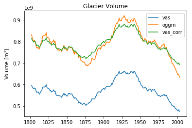

## Relative RMSE with corrected data?!
Since the absolute values of the results produced by OGGM and the VAS model are highly different I thought about a different way of calculating the RMSE.
1. I compute the average difference between the OGGM results and the VAS results
2. The computed average offset is added to the VAS results
3. Then I compute the RMSE between the OGGM results and the *corrected* VAS results

Does this make any sense?!


```python
mean_diff = (df.oggm - df.vas).mean()
df['vas_corr'] = df.vas + mean_diff
ax = df.plot(title='Glacier Volume')
ax.set_ylabel('Volume [m$^3$]');
```





```python
mean = df.oggm.mean()
rmse = np.sqrt(mse(df.oggm, df.vas))
rmse_corr = np.sqrt(mse(df.oggm, df.vas_corr))
print('Relative RMSE with absolute data {:.0f}% vs. with corrected data {:.0f}%.'.\
      format(rmse/mean*100, rmse_corr/mean*100))
```

```bash
$> Relative RMSE with absolute data 28% vs. with corrected data 3%.
```

