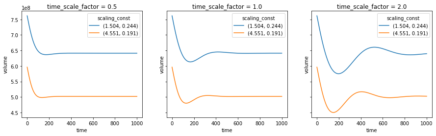
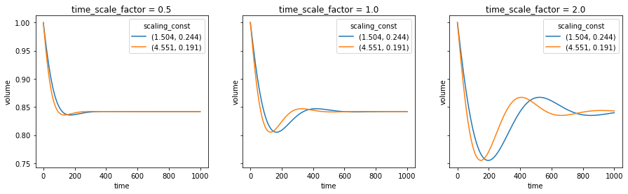
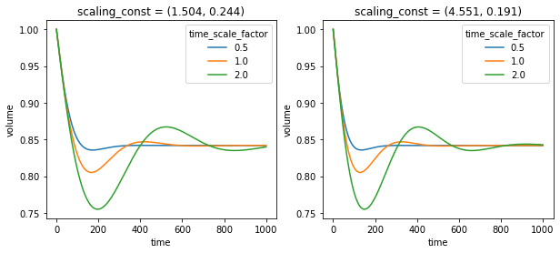
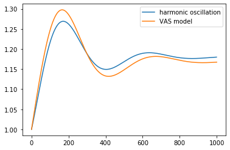

# Sensitivity experiments

<div style="text-align:right"><div style='font-style:italic'><span style='font-weight:bold'>
  "Not all parameters are created equal."</span> - The Declaration of Sensitivity</div></div>

**Introduction, or 'What am I doing?! And why?!'**

A model is a simplification of realty and relies on measurements as input parameters. Measurements are subjected to errors per definition, hence the model runs under false pretenses to begin with... While certain input parameters (as well as internal model parameters) are direct observational values, others cannot (or at least not easily) be measured and are therefore parametrized. Given these uncertainties, it is paramount to investigate the model behavior under changing initial parameter or in other words,  assessing the stability of the model. Does a minor change in initial conditions result in a major change in outcome?! Or can the model be deemed robust, meaning that the exact value of initial conditions is less important than its order of magnitude...

For the VAS model there are two obvious parameter sets which will be investigated, the first being the scaling constants. While the scaling exponent has a physically based values of (cf. Buckingham-Pi theorem) and should not be changed, the scaling constants $c_L$ and $c_A$ (for volume/length and volume/area scaling respectively) are random variables that can vary drastically from glacier to glacier. The rule of large numbers assures that a global volume estimate using volume/area scaling will be reasonable, since the random errors in scaling constants will average out. But when working on a regional scale or even with individual glaciers, the scaling constants should be tuned in order to increase the accuracy of the volume estimate. While the general model behavior will not change, the absolute values of volume can be influenced by the scaling constants.

Another obvious choice for sensitivity parameters are the relaxation time scales $\tau_L$ and $\tau_A$ (for volume/length and volume/area scaling respectively). [Marzeion et al. (2012)][] estimated the time scale of a glaciers length response to volume change as a relation between of glacier volume $V$ and precipiation amount. This makes intuitive sense, since larger glaciers take more time to change their geometries and glaciers subjected to more precipitation i.e., higher mass turn-over, tend to adapt faster.

**Research question, or What do I expect?!:**

As seen with the equilibrium experiments, the VAS scaling model drastically underestimated the volume change compared to the flowline model. Since scaled volume estimates for a single glacier are only order of magnitude estimates, I assume to increase the volume change by changing the scaling constants. Furthermore, the oscillation behavior must be linked to the time scales and I'm certain that a time scale (presumably lower than the current one) will result in a more physical glacier evolution. However, decreasing the time scale will result in faster adaptation, which is again less similar to the flowline model. Here should come some insight into the work of Roe and Baker (2014) with his three stage model. 

**Sensitivity to scaling constants**





**Sensitivity to relaxation times**



**Damped harmonic oscillator**

```python
def dampend_harmonic_oscillation(t, ang_freq=1/70, damping_rate=0.32, amplitude=0.18, phase=np.pi/2+0.5):
    x = amplitude * (1-np.exp(-damping_rate * ang_freq * t) 
                     * np.sin(np.sqrt(1-damping_rate**2)*ang_freq*t+phase) 
                     / np.sin(phase))
    return x + 1

t = np.arange(0,1000,1)
plt.plot(t, dampend_harmonic_oscillation(t), label='harmonic oscillation')
plt.plot(ds.sel(normalized=True).isel(time_scale_factor=2, scaling_const=1).volume.values, label='VAS model')
plt.legend()
```

