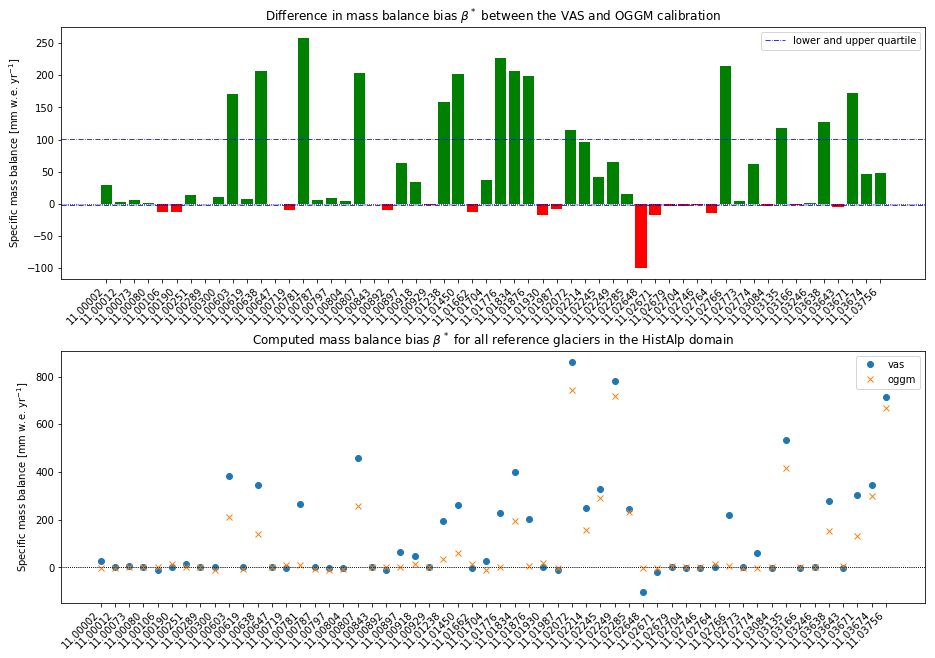

# Generating a $t^*$ reference table

@TODO: write some introductory shit...

### What do I want/need and why?!

The OGGM (and [Marzeion et. al., 2012]() before that) follows these steps in order to calibrate the mass balance model parameters.

1. Get all glaciers with (long enough) records of mass balance measurements, the so called **reference glaciers.**
2. Compute a temperature sensitivity $\mu(t)$ for each year $t$ (more precise for each 31-year climate period centred around the given year), called the **$\mu$-candidates**, by solving the mass balance equation.
3. Use the computed $\mu$-candidates to compute the average yearly mass balance over all years with mass balance records, using the given climate data (HistAlp, CRU, ...). Then compute the difference between the modelled mass balance average and the measured mass balance average. This results in one **mass balance bias** $\beta(t)$ for each year.
4. Find the year $t^*$ with the lowest absolute mass balance bias $\beta(t^*) = \beta^*$ to choose the best fitting temperature sensitivity $\mu(t*) = \mu^*$. Thereby $t^*$ is ... @TODO: find that line where it says: "not like a year but more like a index..."

The above described tasks are performed by the `compute_ref_tstars()` routine, which itself performs the `t_star_from_refmb()` task on every reference glacier. The result is a `*.csv` file containing the temporal index $t^*$ and the corresponding bias $\beta^*$ for each reference glacier.

For all glaciers without a mass balance record, the temporal index $t^*$ is interpolated between the closest ten reference glaciers weighted inversely with distance. This approach is based on the assumption, that neighbouring glaciers are likely to be in an equilibrium state around the same time. The temperature sensitivity $\mu^*$ is far more variable between one glacier and another, since it incorporates all types of different phenomenas such as avalanches, shading, ...

Therefore it is crucial to have said `ref_tstars.csv` list calibrated correctly, since it will be different for different climate files, RGI versions, mass balance models, ...

### What have I done?!

I needed to create my own `ref_tstars.csv` list, since I'm using a (slightly) different approach for the mass balance model. This said, I closely followed the guidance of the `mass_balance_calibration` notebook given on the OGGM documentation website.

The only changes were made to the `t_star_from_refmb()` routine, where I use the `get_yearly_mb_temp_prcp()`  routine from the `oggm.vascaling` module to compute the mass balance relevant melting temperatures and solid precipitation amount for each year. In the following I used the *old* method (see `oggm.climate` code for reference) to compute the $\mu$-candidates, which is simply solving the mass balance equation for $\mu$.

### What did I get?!

In general, the calibration seems to work out quite well. This is not to surprising, since I change very little code. But anyway, the calculated biases are comparable to the values generated by the OGGM.

However, glaciers with rather large biases according to the OGGM show even larger biases using the VAS calibration. This may be due to some *non ideal* glacier forms, which are not described well using a volume/area scaling approach. On the other hand, I'm using calculating any glacier geometrics up to this point... So the take home message is (as usually): I don't know. Yet.



### Does this solve my problem?!

Yes, I think so. From now on I'll use this reference list instead of the one shipped with the OGGM.

### Todo's:

- [x] Store file somewhere more sensible, rather than on my desktop.
- [x] Add to `cfg.initialize()` and ship with sample data?!


## The `oggm` internal routines

### Computing the reference $t^*$ for the glacier

```python
from oggm.core.massbalance import MultipleFlowlineMassBalance

def t_star_from_refmb(gdir, mbdf=None, glacierwide=None,
                      write_diagnostics=False):
    """Computes the ref t* for the glacier, given a series of MB measurements.

    Parameters
    ----------
    gdir : oggm.GlacierDirectory
    mbdf: a pd.Series containing the observed MB data indexed by year
        if None, read automatically from the reference data

    Returns
    -------
    A dict: {t_star:[], bias:[]}
    """
```

Computes the reference year $t^*$ for the given glacier, depending on the mass balance measurements. The glacier `gdir` is specified via a `oggm.GlacierDirectory`, while the mass balance measurements `mbdf` come as a `pandas.Series` index by year. The parameter `glacierwide` ... @TODO

```python
	# @TODO
	if glacierwide is None:
        glacierwide = cfg.PARAMS['tstar_search_glacierwide']

    # Make sure we have no marine terminating glacier
    assert gdir.terminus_type == 'Land-terminating'

    # Reference time series
    if mbdf is None:
        mbdf = gdir.get_ref_mb_data()['ANNUAL_BALANCE']

    # which years to look at
    ref_years = mbdf.index.values

    # Average observed mass-balance
    ref_mb = np.mean(mbdf)
```

First things first:

The calibration works only for land-terminating glaciers, since zero mass balance is assumed. The default WGMS mass balance measurements are used, if no mass balance measurements are supplied. Next, gather years with mass balance measurements and compute the average measured mass balance.

```python
    # Compute one mu candidate per year and the associated statistics
    # Only get the years were we consider looking for tstar
    y0, y1 = cfg.PARAMS['tstar_search_window']
    ci = gdir.read_pickle('climate_info')
    y0 = y0 or ci['baseline_hydro_yr_0']
    y1 = y1 or ci['baseline_hydro_yr_1']
    years = np.arange(y0, y1+1)

    ny = len(years)
    mu_hp = int(cfg.PARAMS['mu_star_halfperiod'])
    mb_per_mu = pd.Series(index=years)
```

The start and end year where OGGM will search for $t^*$-candidates can be specified by the `t_start_seach_window` parameter. If not, the full period with available climate data is used. The empty container `mb_per_mu` will later on store the mass balance over the climatological period for each $\mu$-candidate.

```python
    if glacierwide:
        # The old (but fast) method to find t*
        _, temp, prcp = mb_yearly_climate_on_glacier(gdir, year_range=[y0, y1])

        # which years to look at
        selind = np.searchsorted(years, mbdf.index)
        sel_temp = temp[selind]
        sel_prcp = prcp[selind]
        sel_temp = np.mean(sel_temp)
        sel_prcp = np.mean(sel_prcp)

        for i, y in enumerate(years):

            # Ignore begin and end
            if ((i - mu_hp) < 0) or ((i + mu_hp) >= ny):
                continue

            # Compute the mu candidate
            t_avg = np.mean(temp[i - mu_hp:i + mu_hp + 1])
            if t_avg < 1e-3:  # if too cold no melt possible
                continue
            mu = np.mean(prcp[i - mu_hp:i + mu_hp + 1]) / t_avg

            # Apply it
            mb_per_mu[y] = np.mean(sel_prcp - mu * sel_temp)
```

The **old (but fast)** method to find $t^*$ consists of the following steps:

Get the mass balance relevante climate parameters (melting temperature and solid precipitation) for every year in the above define period (between `y0` and `y1`) . Next, an average temperature and precipitation over all years with mass balance measurements are computed.

The loop iterates again over all years in the above define period, whereby the beginning and end (depending on the length of the half climate period) are ignored. The $\mu(t)$-candidate is computed for each year $t$, given that the average temperature in the climate period centred around that year is not too cold (i.e. no melt occurs). Give a successful computation, the $\mu(t)$-candidate is used to compute the mass balance using the average climate parameters over years with mass balance measurements.

```python
    else:
        # The new (but slow) method to find t*
        # Compute mu for each 31-yr climatological period
        fls = gdir.read_pickle('inversion_flowlines')
        for i, y in enumerate(years):
            # Ignore begin and end
            if ((i-mu_hp) < 0) or ((i+mu_hp) >= ny):
                continue
            # Calibrate the mu for this year
            for fl in fls:
                fl.mu_star_is_valid = False
            try:
                # TODO: this is slow and can be highly optimised
                # it reads the same data over and over again
                _recursive_mu_star_calibration(gdir, fls, y, first_call=True)
                # Compute the MB with it
                mb_mod = MultipleFlowlineMassBalance(gdir, fls, bias=0,
                                                     check_calib_params=False)
                mb_ts = mb_mod.get_specific_mb(fls=fls, year=ref_years)
                mb_per_mu[y] = np.mean(mb_ts)
            except MassBalanceCalibrationError:
                pass
```


```python
    # Diff to reference
    diff = (mb_per_mu - ref_mb).dropna()

    if len(diff) == 0:
        raise MassBalanceCalibrationError('No single valid mu candidate for '
                                          'this glacier!')

    # Here we used to keep all possible mu* in order to later select
    # them based on some distance search algorithms.
    # (revision 81bc0923eab6301306184d26462f932b72b84117)
    #
    # As of Jul 2018, we will now stop this non-sense:
    # out of all mu*, let's just pick the one with the smallest bias.
    # It doesn't make much sense, but the same is true for other methods
    # as well -> this is how Ben used to do it, and he is clever
    # Another way would be to pick the closest to today or something
    amin = np.abs(diff).idxmin()

    # Write
    d = gdir.read_pickle('climate_info')
    d['t_star'] = amin
    d['bias'] = diff[amin]
    if write_diagnostics:
        d['avg_mb_per_mu'] = mb_per_mu
        d['avg_ref_mb'] = ref_mb

    gdir.write_pickle(d, 'climate_info')

    return {'t_star': amin, 'bias': diff[amin]}
```

### Computing glacier wide $\mu$-candidates for each 31-year period

```python
@entity_task(log, writes=['climate_info'])
def glacier_mu_candidates(gdir):
    """Computes the mu candidates, glacier wide.

    For each 31 year-period centered on the year of interest, mu is is the
    temperature sensitivity necessary for the glacier with its current shape
    to be in equilibrium with its climate.

    This task is just for documentation and testing! It is not used in
    production anymore.

    Parameters
    ----------
    gdir : :py:class:`oggm.GlacierDirectory`
        the glacier directory to process
    """

    warnings.warn('The task `glacier_mu_candidates` is deprecated. It should '
                  'only be used for testing.', DeprecationWarning)

    mu_hp = int(cfg.PARAMS['mu_star_halfperiod'])

    # Only get the years were we consider looking for tstar
    y0, y1 = cfg.PARAMS['tstar_search_window']
    ci = gdir.read_pickle('climate_info')
    y0 = y0 or ci['baseline_hydro_yr_0']
    y1 = y1 or ci['baseline_hydro_yr_1']

    years, temp_yr, prcp_yr = mb_yearly_climate_on_glacier(gdir,
                                                           year_range=[y0, y1])

    # Compute mu for each 31-yr climatological period
    ny = len(years)
    mu_yr_clim = np.zeros(ny) * np.NaN
    for i, y in enumerate(years):
        # Ignore begin and end
        if ((i-mu_hp) < 0) or ((i+mu_hp) >= ny):
            continue
        t_avg = np.mean(temp_yr[i-mu_hp:i+mu_hp+1])
        if t_avg > 1e-3:  # if too cold no melt possible
            prcp_ts = prcp_yr[i-mu_hp:i+mu_hp+1]
            mu_yr_clim[i] = np.mean(prcp_ts) / t_avg

    # Check that we found a least one mustar
    if np.sum(np.isfinite(mu_yr_clim)) < 1:
        raise MassBalanceCalibrationError('({}) no mustar candidates found.'
                                          .format(gdir.rgi_id))

    # Write
    ci['mu_candidates_glacierwide'] = pd.Series(data=mu_yr_clim, index=years)
    gdir.write_pickle(ci, 'climate_info')

```

